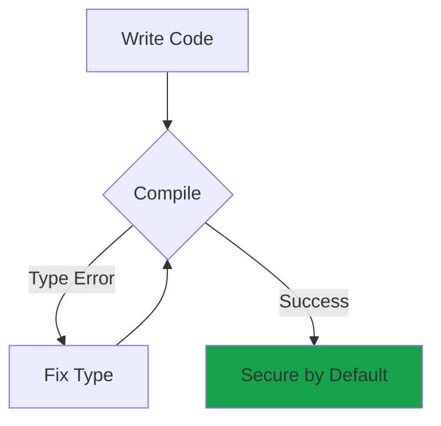
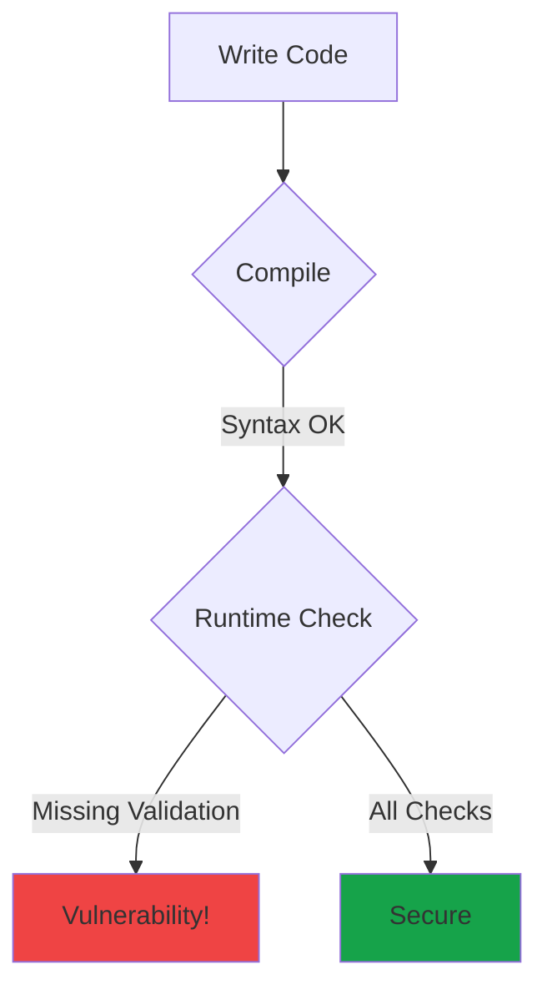

# Anchor vs Pinocchio: Security Comparison

A detailed analysis of how the two major Solana development frameworks handle security, with real code examples from our vulnerability demonstrations.

## Overview

<CardGroup cols={2}>
  <Card title="Anchor" icon="anchor">
    **Type-safe, macro-driven framework**

    Automatic security checks via type system
  </Card>
  <Card title="Pinocchio" icon="bolt">
    **Zero-copy, performance-first framework**

    Manual validation, maximum control
  </Card>
</CardGroup>

## Core Philosophy

<Tabs>
  <Tab title="Anchor">
    ### Safety Through Abstraction

    Anchor prioritizes **developer experience** and **security by default**:

    - Uses Rust's type system to enforce security checks
    - Macros generate validation code automatically
    - Constraintbased programming reduces boilerplate
    - Compiler errors guide you to secure patterns

    **Trade-off:** Slight overhead in binary size and runtime performance for significantly improved safety.
  </Tab>

  <Tab title="Pinocchio">
    ### Performance Through Control

    Pinocchio prioritizes **performance** and **minimal overhead**:

    - Zero-copy account access
    - Direct memory manipulation
    - No macro overhead
    - Minimal runtime abstraction

    **Trade-off:** Developer must manually implement all security checks. Easy to miss critical validations.
  </Tab>
</Tabs>

## Security Feature Comparison

| Security Feature | Anchor | Pinocchio | Winner |
|-----------------|--------|-----------|---------|
| **Signer Validation** | `Signer<'info>` type | Manual `is_signer()` check | Anchor ⭐ |
| **Owner Validation** | `Account<T>` type | Manual owner comparison | Anchor ⭐ |
| **Program Validation** | `Program<'info, T>` | Manual program ID check | Anchor ⭐ |
| **Discriminator Checks** | Automatic | Manual | Anchor ⭐ |
| **Initialization Protection** | `init` constraint | Manual flag check | Anchor ⭐ |
| **Binary Size** | ~250 KB | ~80 KB | Pinocchio ⭐ |
| **Runtime Performance** | Good | Excellent | Pinocchio ⭐ |
| **Compute Units** | Moderate | Minimal | Pinocchio ⭐ |

## Code Comparison: Signer Checks

<CodeGroup>
```rust Anchor - Vulnerable
#[derive(Accounts)]
pub struct UpdateOwnership<'info> {
    // VULNERABILITY: UncheckedAccount doesn't validate signature
    /// CHECK: INTENTIONALLY VULNERABLE
    pub owner: UncheckedAccount<'info>,

    #[account(mut, has_one = owner)]
    pub program_account: Account<'info, ProgramAccount>,
}
```

```rust Anchor - Secure
#[derive(Accounts)]
pub struct UpdateOwnership<'info> {
    // FIX: Signer type enforces signature validation
    pub owner: Signer<'info>,

    #[account(mut, has_one = owner)]
    pub program_account: Account<'info, ProgramAccount>,
}
```

```rust Pinocchio - Vulnerable
fn update_owner(accounts: &[AccountInfo]) -> ProgramResult {
    let [owner_info, program_account_info, _] = accounts else {
        return Err(ProgramError::NotEnoughAccountKeys);
    };

    // VULNERABILITY: Missing is_signer() check
    // Proceeds without validating signature

    // Update owner
    data[1..33].copy_from_slice(new_owner_info.key().as_ref());
    Ok(())
}
```

```rust Pinocchio - Secure
fn update_owner(accounts: &[AccountInfo]) -> ProgramResult {
    let [owner_info, program_account_info, _] = accounts else {
        return Err(ProgramError::NotEnoughAccountKeys);
    };

    // FIX: Explicit is_signer() check
    if !owner_info.is_signer() {
        return Err(ProgramError::MissingRequiredSignature);
    }

    // Update owner
    data[1..33].copy_from_slice(new_owner_info.key().as_ref());
    Ok(())
}
```
</CodeGroup>

<Info>
**Key Difference:** Anchor's `Signer` type makes it impossible to forget signature validation. Pinocchio requires you to remember every check manually.
</Info>

## Code Comparison: Owner Checks

<CodeGroup>
```rust Anchor - Secure
#[derive(Accounts)]
pub struct UpdateAccount<'info> {
    pub authority: Signer<'info>,

    // Account<T> automatically validates:
    // 1. Account is owned by the program
    // 2. Account discriminator matches T
    // 3. Account data deserializes to T
    #[account(mut, has_one = authority)]
    pub program_account: Account<'info, ProgramAccount>,
}
```

```rust Pinocchio - Secure
fn update_account(accounts: &[AccountInfo]) -> ProgramResult {
    let [authority_info, program_account_info] = accounts else {
        return Err(ProgramError::NotEnoughAccountKeys);
    };

    // Manual checks required:
    // 1. Validate signer
    if !authority_info.is_signer() {
        return Err(ProgramError::MissingRequiredSignature);
    }

    // 2. Validate owner
    if program_account_info.owner() != &ID {
        return Err(ProgramError::InvalidAccountOwner);
    }

    // 3. Validate discriminator (if using)
    let data = program_account_info.try_borrow_data()?;
    if data[0] != ACCOUNT_DISCRIMINATOR {
        return Err(ProgramError::InvalidAccountData);
    }

    // 4. Validate authority matches
    let stored_authority = Pubkey::from(/* ... */);
    if stored_authority != *authority_info.key() {
        return Err(ProgramError::InvalidAccountData);
    }

    Ok(())
}
```
</CodeGroup>

<Warning>
Pinocchio requires **4 manual checks** for what Anchor does automatically with one type. Missing any check creates a vulnerability.
</Warning>

## Code Comparison: Arbitrary CPI

<CodeGroup>
```rust Anchor - Secure
#[derive(Accounts)]
pub struct TransferTokens<'info> {
    #[account(mut)]
    pub vault: Account<'info, TokenAccount>,

    // Program<'info, Token> validates the program ID
    // Ensures only the real Token program can be called
    pub token_program: Program<'info, Token>,
}

pub fn transfer(ctx: Context<TransferTokens>, amount: u64) -> Result<()> {
    // Safe: token_program is validated to be the real Token program
    token::transfer(
        CpiContext::new(
            ctx.accounts.token_program.to_account_info(),
            Transfer { /* ... */ },
        ),
        amount,
    )
}
```

```rust Pinocchio - Secure
fn transfer_tokens(accounts: &[AccountInfo], amount: u64) -> ProgramResult {
    let [vault_info, token_program_info] = accounts else {
        return Err(ProgramError::NotEnoughAccountKeys);
    };

    // MUST manually validate the program ID
    if token_program_info.key() != &spl_token::ID {
        return Err(ProgramError::IncorrectProgramId);
    }

    // Now safe to invoke
    invoke(
        &token_instruction::transfer(/* ... */)?,
        &[vault_info, token_program_info],
    )
}
```
</CodeGroup>

## Development Experience

### Anchor: Guided by Types



<Accordion title="Anchor Developer Experience">
  **Pros:**
  - Type system catches security issues at compile time
  - Clear error messages guide you to fixes
  - Constraints handle common patterns automatically
  - Less code to write and maintain
  - Easier onboarding for new developers

  **Cons:**
  - Macro compilation can be slow
  - Less control over generated code
  - Slightly larger binaries
  - Learning curve for macro system
</Accordion>

### Pinocchio: Freedom and Responsibility



<Accordion title="Pinocchio Developer Experience">
  **Pros:**
  - Complete control over every operation
  - Zero-copy memory access
  - Smallest possible binaries
  - Fastest runtime performance
  - No macro overhead

  **Cons:**
  - Must remember every security check
  - Easy to introduce vulnerabilities
  - More boilerplate code
  - Steeper learning curve
  - Requires deep Solana knowledge
</Accordion>

## Performance Benchmarks

<Tabs>
  <Tab title="Binary Size">
    Compiled program sizes for the same logic:

    | Program | Anchor | Pinocchio | Difference |
    |---------|--------|-----------|------------|
    | Signer Checks | 248 KB | 82 KB | **-67%** |
    | Owner Checks | 252 KB | 79 KB | **-69%** |
    | Arbitrary CPI | 276 KB | 91 KB | **-67%** |
    | Type Cosplay | 265 KB | 86 KB | **-68%** |

    <Note>
    Pinocchio programs are consistently **~70% smaller** due to zero-copy design and lack of macro overhead.
    </Note>
  </Tab>

  <Tab title="Compute Units">
    Approximate compute unit (CU) usage:

    | Operation | Anchor | Pinocchio | Difference |
    |-----------|--------|-----------|------------|
    | Account Validation | 2,500 CU | 800 CU | **-68%** |
    | Data Deserialization | 3,200 CU | 200 CU | **-94%** |
    | CPI Call Setup | 1,800 CU | 600 CU | **-67%** |

    <Warning>
    For high-frequency operations or complex transactions, compute unit savings can make the difference between success and failure.
    </Warning>
  </Tab>

  <Tab title="Memory Usage">
    Stack memory consumption:

    | Framework | Average Stack Usage | Peak Stack Usage |
    |-----------|---------------------|------------------|
    | Anchor | 12-18 KB | 24 KB |
    | Pinocchio | 4-6 KB | 8 KB |

    <Tip>
    Pinocchio's zero-copy design means accounts are read directly from transaction buffers without deserialization overhead.
    </Tip>
  </Tab>
</Tabs>

## When to Use Each Framework

```mermaid
%%{init: {'theme':'dark'}}%%
quadrantChart
    title Security vs Performance Tradeoff
    x-axis Low Security --> High Security
    y-axis Low Performance --> High Performance
    quadrant-1 Ideal (Use Pinocchio + Manual Checks)
    quadrant-2 Over-Engineered
    quadrant-3 Dangerous (Avoid)
    quadrant-4 Safe but Slow

    Anchor: [0.85, 0.65]
    Pinocchio Secure: [0.75, 0.95]
    Pinocchio Vulnerable: [0.25, 0.95]
    Native Rust: [0.70, 0.98]
```

### Use Anchor When:

<CardGroup cols={2}>
  <Card title="Starting Out" icon="seedling">
    Learning Solana development? Anchor's guardrails prevent common mistakes.
  </Card>
  <Card title="DeFi Applications" icon="coins">
    Handling user funds? Anchor's automatic checks reduce risk.
  </Card>
  <Card title="Team Projects" icon="users">
    Multiple developers? Anchor's type system catches errors during code review.
  </Card>
  <Card title="Rapid Prototyping" icon="rocket">
    Building quickly? Anchor's constraints reduce boilerplate.
  </Card>
</CardGroup>

### Use Pinocchio When:

<CardGroup cols={2}>
  <Card title="Performance Critical" icon="gauge-high">
    Every compute unit matters? Pinocchio's zero-copy design delivers maximum performance.
  </Card>
  <Card title="Size Constrained" icon="compress">
    Program size limits an issue? Pinocchio produces the smallest binaries.
  </Card>
  <Card title="Expert Developers" icon="user-ninja">
    Team has deep Solana expertise? Leverage maximum control.
  </Card>
  <Card title="Native Programs" icon="microchip">
    Building core infrastructure? Pinocchio mirrors native program patterns.
  </Card>
</CardGroup>

## Migration Strategy

<Steps>
  <Step title="Start with Anchor">
    Build your initial implementation in Anchor to get the logic right with built-in security.
  </Step>

  <Step title="Profile Performance">
    Measure compute units, binary size, and identify bottlenecks.
  </Step>

  <Step title="Selective Optimization">
    Rewrite only performance-critical paths in Pinocchio while keeping the rest in Anchor.
  </Step>

  <Step title="Maintain Security">
    For Pinocchio code, create a security checklist based on Anchor's automatic checks.
  </Step>
</Steps>

## Security Checklist

### Anchor Review Checklist

- [ ] All authority accounts use `Signer<'info>`
- [ ] All program accounts use `Account<'info, T>`
- [ ] CPI targets use `Program<'info, T>`
- [ ] Initialization uses `init` constraint
- [ ] Close operations use `close` constraint
- [ ] All constraints are tested

### Pinocchio Review Checklist

- [ ] All signers validated with `is_signer()`
- [ ] All accounts validated with `owner()` check
- [ ] All CPI targets validated with program ID check
- [ ] Discriminators checked for account types
- [ ] Initialization flags checked
- [ ] All validations happen BEFORE state changes
- [ ] Test suite includes exploit attempts

## Real-World Examples

<AccordionGroup>
  <Accordion title="Anchor Success Story: Marinade Finance">
    Marinade Finance uses Anchor for their liquid staking protocol, managing **$300M+ TVL**. The type safety and automatic checks have prevented multiple potential exploits caught during audits.

    **Why Anchor:** Managing user funds requires maximum security. The team prioritized safety over marginal performance gains.
  </Accordion>

  <Accordion title="Pinocchio Success Story: Token Program">
    Solana's native Token program (SPL Token) uses patterns similar to Pinocchio's zero-copy approach. It processes **millions of transfers daily** with minimal compute unit usage.

    **Why Native/Pinocchio:** Core infrastructure requires maximum performance. Expert developers can maintain security through rigorous reviews and testing.
  </Accordion>
</AccordionGroup>

## Conclusion

<Tabs>
  <Tab title="For Most Projects">
    ### Choose Anchor

    Unless you have specific performance requirements or expert-level developers, **Anchor is the right choice**:

    - Security by default
    - Faster development
    - Easier maintenance
    - Better for teams
    - Sufficient performance for 95% of use cases
  </Tab>

  <Tab title="For High-Performance">
    ### Choose Pinocchio Carefully

    If you need maximum performance and have the expertise:

    - Establish strict security review processes
    - Create comprehensive test suites with exploit attempts
    - Use this repository as a reference for secure patterns
    - Consider hybrid approach (Anchor + Pinocchio hotspaths)
  </Tab>
</Tabs>

<Warning>
**Performance should NEVER come at the cost of security.** If choosing Pinocchio, ensure your team has the expertise to implement all security checks correctly.
</Warning>

## Further Reading

<CardGroup cols={3}>
  <Card title="Vulnerability Examples" icon="shield-halved" href="/vulnerabilities/signer-checks">
    See real security issues in both frameworks
  </Card>
  <Card title="Security Tradeoffs" icon="scale-unbalanced" href="/comparisons/security-tradeoffs">
    Deep dive into framework security models
  </Card>
  <Card title="Source Code" icon="github" href="https://github.com/superteamng/solana-security-reference">
    Study the complete implementations
  </Card>
</CardGroup>
