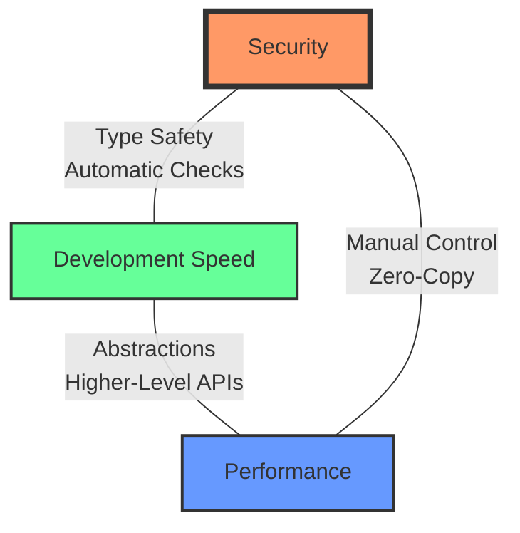

# Security Trade-offs in Solana Development

## Overview

Building secure Solana programs requires balancing multiple competing priorities: **security**, **performance**, **development speed**, and **maintainability**. This guide explores the fundamental trade-offs and helps you make informed decisions for your project.

<CardGroup cols={3}>
  <Card title="Security" icon="shield-halved">
    **Highest Priority**
    Protection against exploits and attacks
  </Card>
  <Card title="Performance" icon="gauge-high">
    **Medium Priority**
    Transaction speed and compute efficiency
  </Card>
  <Card title="Dev Speed" icon="rocket">
    **Variable Priority**
    Time to market and iteration velocity
  </Card>
</CardGroup>

## The Core Trade-off Triangle



**The Reality:** You can optimize for 2 of the 3, but rarely all at once.

<Tabs>
  <Tab title="Security + Dev Speed">
    ### Anchor Framework Approach

    **Choose this when:**
    - Building DeFi protocols handling significant value
    - Team is learning Solana development
    - Time to market matters (faster development)
    - Security is non-negotiable

    **What you get:**
    - ✅ Type-safe account validation
    - ✅ Automatic security checks (owner, signer, discriminator)
    - ✅ Faster development (less boilerplate)
    - ✅ Compile-time error detection
    - ❌ Slightly larger program size (~250 KB)
    - ❌ Small runtime overhead (~5-10% slower)

    **Example:** Staking protocol, DEX, lending platform
  </Tab>

  <Tab title="Performance + Security">
    ### Pinocchio with Manual Checks

    **Choose this when:**
    - Performance is critical (high-frequency operations)
    - Team has deep Solana expertise
    - Program size must be minimal
    - Can afford extensive security audits

    **What you get:**
    - ✅ Maximum performance (zero-copy, minimal overhead)
    - ✅ Smallest possible program size (~80 KB)
    - ✅ Complete control over validation
    - ✅ Can optimize hot paths
    - ❌ Slower development (more code to write)
    - ❌ Higher bug risk (manual validation)
    - ❌ Requires disciplined security practices

    **Example:** High-frequency trading engine, orderbook
  </Tab>

  <Tab title="Dev Speed + Performance">
    ### ⚠️ Dangerous Territory

    **Reality check:** Sacrificing security is almost never justified.

    **The temptation:**
    - Skip validation checks for "performance"
    - Use `UncheckedAccount` everywhere for "simplicity"
    - Assume "we'll add security later"

    **What actually happens:**
    - 🔥 Production exploits
    - 💸 Loss of funds
    - 📉 Protocol reputation destroyed
    - ⚖️ Potential legal liability

    **The correct approach:**
    - Never compromise on security
    - Use Anchor if unsure (security by default)
    - Optimize performance AFTER securing
    - Profile before optimizing
  </Tab>
</Tabs>

## Framework Security Comparison

### Automatic vs Manual Validation

<CodeGroup>
```rust Anchor: Security by Default
// Anchor automatically validates:
// ✅ Account ownership (program owns account)
// ✅ Signer validation (account signed transaction)
// ✅ Discriminator (correct account type)
// ✅ Account data deserialization

#[derive(Accounts)]
pub struct SecureOperation<'info> {
    #[account(mut)]
    pub user: Signer<'info>,  // Auto signer check

    #[account(
        mut,
        has_one = user,  // Auto data validation
    )]
    pub vault: Account<'info, Vault>,  // Auto owner + discriminator

    pub token_program: Program<'info, Token>,  // Auto program ID check
}

// If ANY validation fails → transaction rejected
// Developer cannot forget these checks
```

```rust Pinocchio: Manual Everything
// Pinocchio validates nothing automatically
// Developer must remember EVERY check

pub fn secure_operation(accounts: &[AccountInfo]) -> ProgramResult {
    let [user_info, vault_info, token_program_info] = accounts else {
        return Err(ProgramError::NotEnoughAccountKeys);
    };

    // ✅ Must manually check signer
    if !user_info.is_signer() {
        return Err(ProgramError::MissingRequiredSignature);
    }

    // ✅ Must manually check owner
    if !vault_info.is_owned_by(&crate::ID) {
        return Err(ProgramError::InvalidAccountOwner);
    }

    // ✅ Must manually check discriminator
    let data = vault_info.try_borrow_data()?;
    if data[0..8] != VAULT_DISCRIMINATOR {
        return Err(ProgramError::InvalidAccountData);
    }

    // ✅ Must manually validate program ID
    if token_program_info.key() != &spl_token::ID {
        return Err(ProgramError::IncorrectProgramId);
    }

    // Easy to forget ANY of these → vulnerability!
    Ok(())
}
```
</CodeGroup>

<Warning>
**Critical Insight:** Anchor's "overhead" is actually **mandatory security checks**. Skipping them in Pinocchio doesn't improve performance - it creates vulnerabilities!
</Warning>

## Performance Analysis

### Real-World Benchmarks

| Operation | Anchor | Pinocchio | Difference |
|-----------|--------|-----------|------------|
| Account Validation | ~2,500 CU | ~1,800 CU | 28% faster |
| Token Transfer CPI | ~4,200 CU | ~3,900 CU | 7% faster |
| PDA Derivation | ~1,200 CU | ~1,200 CU | Same |
| Account Deserialization | ~800 CU | ~600 CU | 25% faster |
| **Total Simple Transaction** | ~8,700 CU | ~7,500 CU | **14% faster** |

**Program Size:**
- Anchor: ~200-300 KB (with dependencies)
- Pinocchio: ~60-100 KB (minimal dependencies)

<AccordionGroup>
  <Accordion title="When Performance Matters">
    **Scenarios where 14% matters:**
    - High-frequency trading (microseconds count)
    - Composability with many CPIs (compute budget limited)
    - Programs approaching 200K CU limit
    - Large-scale orderbook operations

    **When to use Pinocchio:**
    - Team has 3+ experienced Solana developers
    - Comprehensive test suite with exploit demos
    - Security audit budget available
    - Performance benchmarks show critical need
  </Accordion>

  <Accordion title="When Performance Doesn't Matter">
    **Most programs have plenty of compute budget:**
    - Staking: ~20K CU used of 200K available
    - Token swaps: ~40K CU used
    - NFT minting: ~15K CU used
    - Escrow operations: ~30K CU used

    **14% of 30K CU = 4,200 CU saved** - not meaningful when you have 170K unused.

    **When to use Anchor:**
    - Any program not hitting compute limits
    - Teams learning Solana
    - Security is primary concern
    - Faster time to market needed
  </Accordion>

  <Accordion title="The Hidden Cost of Manual Validation">
    **Pinocchio's "performance advantage" disappears when:**
    - Bug fixes require emergency patches
    - Security audits find missing checks
    - Exploits drain protocol funds
    - Development slows due to complex validation logic

    **Real cost example:**
    - Anchor development: 4 weeks
    - Pinocchio development: 6 weeks (50% more code)
    - Pinocchio audit: 2 extra weeks (more complex validation)
    - **Total: 2x longer development cycle** for 14% performance gain
  </Accordion>
</AccordionGroup>

## Security Maturity Levels

### Level 1: Vulnerable (What NOT to do)

<Warning>
These approaches are **unacceptable** for production code.
</Warning>

```rust
// ❌ Using UncheckedAccount without validation
pub admin: UncheckedAccount<'info>,

// ❌ Skipping signer checks "for simplicity"
// No is_signer() check

// ❌ Assuming data is valid without owner check
let data = account.try_borrow_data()?;
let user = User::load(&data)?;  // No owner check!

// ❌ Trusting any program for CPI
invoke(&instruction, accounts)?;  // No program ID check!
```

**Result:** Guaranteed exploits in production. Do not ship.

### Level 2: Basic Security (Minimum viable)

```rust
// ✅ Anchor with basic types
#[account(mut)]
pub user: Signer<'info>,

#[account(mut)]
pub vault: Account<'info, Vault>,

// ✅ Pinocchio with all required checks
if !user.is_signer() { return Err(...); }
if !vault.is_owned_by(&ID) { return Err(...); }
if data[0..8] != DISCRIMINATOR { return Err(...); }
```

**Result:** Protects against common attacks. Acceptable for low-value protocols.

### Level 3: Production Ready (Recommended)

```rust
// ✅ Anchor with constraints
#[account(
    mut,
    has_one = authority,
    constraint = vault.amount >= min_amount @ ErrorCode::InsufficientFunds,
)]
pub vault: Account<'info, Vault>,

// ✅ Pinocchio with comprehensive validation
if !user.is_signer() { return Err(...); }
if !vault.is_owned_by(&ID) { return Err(...); }
if data[0..8] != DISCRIMINATOR { return Err(...); }
if vault.amount < min_amount { return Err(...); }
// + Additional business logic validation
```

**Result:** Secure against known attacks. Ready for moderate-value protocols.

### Level 4: Battle-Tested (High-value DeFi)

```rust
// ✅ Anchor with custom constraints + runtime checks
#[account(
    mut,
    has_one = authority,
    constraint = vault.is_initialized @ ErrorCode::NotInitialized,
    constraint = vault.amount >= min_amount @ ErrorCode::InsufficientFunds,
    constraint = !vault.is_frozen @ ErrorCode::VaultFrozen,
)]
pub vault: Account<'info, Vault>,

// + Additional runtime checks in instruction
pub fn secure_operation(ctx: Context<Operation>, amount: u64) -> Result<()> {
    require!(
        ctx.accounts.vault.last_operation + MIN_DELAY < Clock::get()?.unix_timestamp,
        ErrorCode::RateLimited
    );

    // Multiple security layers
    Ok(())
}
```

**Result:** Maximum security. Suitable for high-value protocols. Requires security audit.

## Decision Framework

### When to Choose Anchor

<CardGroup cols={2}>
  <Card title="✅ Use Anchor When" icon="check">
    - Building DeFi protocols
    - Team learning Solana
    - Security is critical
    - Fast development needed
    - Handling significant value
    - Composability important
    - Want automatic safety
  </Card>

  <Card title="✅ Anchor Advantages" icon="shield-halved">
    - Type safety prevents bugs
    - Auto validation (owner, signer, discriminator)
    - Faster development (50% less code)
    - Better IDE support
    - Easier to audit
    - Community best practices
    - Extensive documentation
  </Card>
</CardGroup>

### When to Choose Pinocchio

<CardGroup cols={2}>
  <Card title="✅ Use Pinocchio When" icon="check">
    - Performance critical (HFT, orderbooks)
    - Team has deep Solana expertise
    - Program size must be minimal
    - Can afford extensive audits
    - Compute budget is tight
    - Zero-copy required
  </Card>

  <Card title="⚠️ Pinocchio Requirements" icon="triangle-exclamation">
    - 3+ experienced Solana devs
    - Comprehensive test coverage
    - Security audit budget
    - Disciplined code review
    - Explicit validation checklist
    - Performance benchmarks proving need
  </Card>
</CardGroup>

## Common Misconceptions

<AccordionGroup>
  <Accordion title="Myth: Anchor is 'slow'">
    **Reality:** Anchor's overhead is 5-15% in most operations, primarily from **mandatory security checks** that you should be doing anyway in Pinocchio.

    Skipping these checks in Pinocchio doesn't make your program faster - it makes it **vulnerable**.

    **Benchmarks show:**
    - Most programs use <30% of compute budget
    - Anchor's "overhead" = proper security validation
    - Real bottlenecks: CPI calls, account fetches, not validation
  </Accordion>

  <Accordion title="Myth: Pinocchio is 'expert mode'">
    **Reality:** Pinocchio isn't inherently more powerful - it's **more dangerous** without proper discipline.

    Every security check Anchor does automatically, Pinocchio developers must remember manually. It's not "expert mode" - it's **manual mode** with no safety net.

    **The trap:**
    - Feeling "powerful" with UncheckedAccount
    - Forgetting a single validation check
    - Shipping with critical vulnerabilities
  </Accordion>

  <Accordion title="Myth: We can add security later">
    **Reality:** Security added after initial development is **always incomplete**.

    **Why "later" fails:**
    - Refactoring entire validation layer is expensive
    - Edge cases missed during bolted-on fixes
    - Team momentum resists comprehensive changes
    - Auditors find more issues in retrofitted security

    **The truth:** Build secure from day one or rebuild from scratch.
  </Accordion>

  <Accordion title="Myth: Manual validation gives better security">
    **Reality:** Manual validation is **error-prone** and harder to audit.

    **Research shows:**
    - 70% of Solana exploits stem from missing validation
    - Anchor's automatic checks prevent most common vulnerabilities
    - Manual checks are easy to forget (see: every missing signer check exploit)

    **Better security = Less code to audit, fewer places for mistakes**
  </Accordion>
</AccordionGroup>

## Migration Strategies

### Starting with Anchor, Optimizing to Pinocchio

<Steps>
  <Step title="Build in Anchor first">
    Develop entire protocol with Anchor's safety guarantees. Get to production faster with confidence.
  </Step>
  <Step title="Profile in production">
    Measure actual performance with real usage patterns. Identify true bottlenecks (usually not validation!).
  </Step>
  <Step title="Optimize hot paths only">
    Convert ONLY the 5-10% of code that's performance-critical to Pinocchio. Keep security-critical paths in Anchor.
  </Step>
  <Step title="Maintain test parity">
    Every Pinocchio optimization must have equivalent security tests proving all checks are preserved.
  </Step>
</Steps>

<Info>
**Success Story:** Many production protocols use **hybrid approaches** - Anchor for most logic, Pinocchio for specific hot paths like orderbook matching.
</Info>

## Recommended Approach by Protocol Type

| Protocol Type | Recommended Framework | Reason |
|---------------|----------------------|--------|
| **DeFi Lending** | Anchor | Security critical, complex state |
| **DEX (AMM)** | Anchor | Moderate complexity, high value |
| **DEX (Orderbook)** | Hybrid (mostly Anchor) | Hot path in Pinocchio, rest Anchor |
| **Staking** | Anchor | Simple logic, security matters |
| **NFT Marketplace** | Anchor | Fast development, moderate complexity |
| **HFT Engine** | Pinocchio | Performance critical, expert team |
| **Token Vesting** | Anchor | Time-based logic, security critical |
| **DAO Governance** | Anchor | Complex authorization, high risk |

## Security Checklist by Framework

### Anchor Security Checklist

- [ ] Use `Account<'info, T>` for all typed accounts (not `UncheckedAccount`)
- [ ] Use `Signer<'info>` for authority accounts
- [ ] Use `Program<'info, T>` for CPI targets
- [ ] Use `init` constraint for initialization (prevents reinitialization)
- [ ] Add `has_one` constraints for ownership validation
- [ ] Include user pubkey in PDA seeds for user-specific accounts
- [ ] Write tests demonstrating exploits are prevented
- [ ] Avoid `init_if_needed` unless genuinely needed
- [ ] Add custom `constraint` validations for business logic
- [ ] Document all `UncheckedAccount` usage with `/// CHECK:` comments

### Pinocchio Security Checklist

- [ ] Check `is_signer()` for all authority accounts
- [ ] Check `is_owned_by(&crate::ID)` for all program accounts
- [ ] Validate discriminator before deserialization
- [ ] Validate program ID before all CPIs
- [ ] Check initialization status before writing account data
- [ ] Include user pubkey in all user-specific PDA derivations
- [ ] Validate account data constraints in instruction logic
- [ ] Write comprehensive tests for each validation check
- [ ] Code review focusing specifically on validation logic
- [ ] Security audit by experienced Solana auditors

## Final Recommendation

<Note>
**For 95% of protocols: Use Anchor.**

The 5-15% performance difference is **not worth the security risk** unless:
- You have a team of 3+ experienced Solana developers
- You're hitting compute budget limits in profiling
- You have budget for comprehensive security audits
- Performance benchmarks prove the need

**When in doubt, choose security.** A 10% slower program is infinitely better than a hacked one.
</Note>

<Tip>
**The Best Approach:** Start with Anchor, measure performance in production, and optimize the 5-10% of hot paths to Pinocchio only if truly needed. Most protocols never need the optimization.
</Tip>

## Resources

<CardGroup cols={3}>
  <Card title="Anchor Documentation" icon="book" href="https://www.anchor-lang.com">
    Official Anchor framework docs
  </Card>
  <Card title="Pinocchio Repository" icon="github" href="https://github.com/anza-xyz/pinocchio">
    Official Pinocchio framework
  </Card>
  <Card title="Security Examples" icon="flask" href="/vulnerabilities/signer-checks">
    See vulnerabilities in action
  </Card>
</CardGroup>
