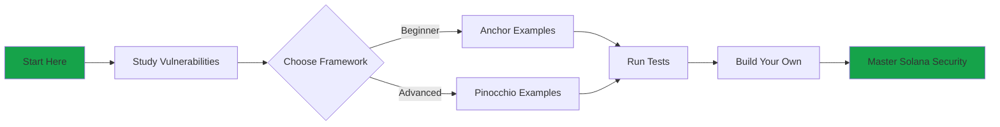

# Learn Solana Security by Example

Master Solana program security by studying real vulnerabilities, their exploits, and proven fixes. Every example includes implementations in both **Anchor** and **Pinocchio** frameworks.

<CardGroup cols={3}>
  <Card title="12 Vulnerabilities" icon="shield-halved">
    Critical security issues with real exploits and fixes
  </Card>
  <Card title="Both Frameworks" icon="code">
    Complete implementations in Anchor and Pinocchio
  </Card>
  <Card title="Full Test Suite" icon="flask">
    Automated tests proving exploits and demonstrating fixes
  </Card>
</CardGroup>

## Why This Matters

<Warning>
Security vulnerabilities are the **#1 cause** of lost funds in Solana DeFi. Most exploits come from simple mistakes that are easy to prevent.
</Warning>

This reference teaches you to:
- **Identify** vulnerabilities in existing code
- **Understand** why they're dangerous
- **Fix** them using proven patterns
- **Test** your fixes with automated exploits

## The Security Matrix

```
┌─────────────────────────────────────────────────────────────────┐
│                    SOLANA SECURITY MATRIX                       │
│                                                                 │
│                           FREQUENCY                             │
│                      Rare ←─────→ Common                        │
│                        │                                        │
│           ┌───────────┬┴──────────────────┐                    │
│           │           │                   │                    │
│  CRITICAL │    CPI    │     ACCOUNT       │                    │
│           │   VULNS   │    VALIDATION     │  ← START HERE      │
│           │           │                   │    (Most exploits) │
│   IMPACT  │ Arbitrary │  Signer Checks    │                    │
│           │ CPI       │  Owner Checks     │                    │
│           │           │  Type Cosplay     │                    │
│           ├───────────┼───────────────────┤                    │
│           │           │                   │                    │
│      LOW  │   RUST    │   PDAs &          │                    │
│           │  ISSUES   │  ARITHMETIC       │                    │
│           │           │                   │                    │
│           │ Reinit    │  PDA Sharing      │                    │
│           │ Panics    │  Bump Seeds       │                    │
│           │           │  Overflows        │                    │
│           └───────────┴───────────────────┘                    │
│                                                                 │
│  💡 Focus on TOP RIGHT first - that's where the money is lost  │
└─────────────────────────────────────────────────────────────────┘
```

## What's Covered

### 🔴 Account Validation (Critical & Common)
*Where most exploits happen. Focus here first.*

<CardGroup cols={3}>
  <Card title="Signer Checks" icon="signature" href="/vulnerabilities/signer-checks">
    "Did they sign?" - Unauthorized modifications
  </Card>
  <Card title="Owner Checks" icon="user-shield" href="/vulnerabilities/owner-checks">
    "Do we own it?" - Fake account substitution
  </Card>
  <Card title="Type Cosplay" icon="masks-theater" href="/vulnerabilities/type-cosplay">
    "Is type real?" - Account type confusion
  </Card>
</CardGroup>

### 🟠 CPI Vulnerabilities (Critical & Rare)
*Less common, but devastating when exploited.*

<CardGroup cols={2}>
  <Card title="Arbitrary CPI" icon="arrows-rotate" href="/vulnerabilities/arbitrary-cpi">
    "Safe program?" - Malicious program invocation
  </Card>
  <Card title="Closing Accounts" icon="xmark" href="/vulnerabilities/closing-accounts">
    "Data zeroed?" - Account revival after close
  </Card>
</CardGroup>

### 🟡 PDAs & Arithmetic (Medium & Common)
*Subtle bugs that add up over time.*

<CardGroup cols={3}>
  <Card title="PDA Sharing" icon="share-nodes" href="/vulnerabilities/pda-sharing">
    "Unique seeds?" - Cross-user authority exploitation
  </Card>
  <Card title="Bump Seed Canonicalization" icon="seedling" href="/vulnerabilities/bump-seed-canonicalization">
    "Canonical bump?" - Non-canonical PDA derivation
  </Card>
  <Card title="Integer Overflow" icon="calculator" href="/vulnerabilities/integer-overflow">
    "Checked math?" - Silent wrapping arithmetic
  </Card>
</CardGroup>

### 🟢 Rust & Lifecycle (Low & Rare)
*Rust helps prevent most of these.*

<CardGroup cols={2}>
  <Card title="Reinitialization" icon="repeat" href="/vulnerabilities/reinitialization-attacks">
    "Already init?" - Account state overwrite
  </Card>
  <Card title="Unsafe Rust" icon="triangle-exclamation" href="/vulnerabilities/unsafe-rust">
    "Safe memory?" - Raw pointer misuse
  </Card>
  <Card title="Panic Handling" icon="bomb" href="/vulnerabilities/panic-handling">
    "Graceful error?" - Unwrap and index panics
  </Card>
  <Card title="Dependency Security" icon="box" href="/vulnerabilities/dependency-security">
    "Trusted crate?" - Supply chain risks
  </Card>
</CardGroup>

## Quick Start

<Steps>
  <Step title="Clone the Repository">
    ```bash
    git clone https://github.com/danielAsaboro/solana_badger
    cd solana_badger
    ```
  </Step>

  <Step title="Install Dependencies">
    ```bash
    # Install Rust and Solana
    curl --proto '=https' --tlsv1.2 -sSf https://sh.rustup.rs | sh
    sh -c "$(curl -sSfL https://release.solana.com/stable/install)"

    # Install Anchor
    cargo install --git https://github.com/coral-xyz/anchor avm --locked
    avm install latest
    avm use latest

    # Install Node dependencies
    npm install
    ```
  </Step>

  <Step title="Build Programs">
    ```bash
    # Build all programs
    ./scripts/build-all.sh

    # Or build individually
    cd programs/signer-checks/vulnerable/anchor && anchor build
    ```
  </Step>

  <Step title="Run Tests">
    ```bash
    # Run exploit demonstrations
    npm test

    # Test specific vulnerability
    npm test -- signer-checks
    ```
  </Step>
</Steps>

## Framework Comparison

Not sure which framework to use? We've got you covered.

<CardGroup cols={2}>
  <Card title="Anchor Framework" icon="anchor" href="/comparisons/anchor-vs-pinocchio">
    **Type-safe, beginner-friendly**

    - Automatic security checks
    - Macro-driven development
    - Larger binary size (~250 KB)
    - Recommended for most projects
  </Card>

  <Card title="Pinocchio Framework" icon="bolt" href="/comparisons/anchor-vs-pinocchio">
    **High-performance, manual control**

    - Zero-copy operations
    - Manual validation required
    - Minimal binary size (~80 KB)
    - Recommended for performance-critical apps
  </Card>
</CardGroup>

## Learning Path



<Accordion title="Recommended Order">
  1. **Start with Account Validation (🔴)** - Signer Checks, Owner Checks, and Type Cosplay
  2. **Read the code** - Compare vulnerable vs secure implementations
  3. **Run the tests** - See exploits work, then fail after fixes
  4. **Experiment** - Modify code and see what breaks
  5. **Move to CPI Vulnerabilities (🟠)** - Arbitrary CPI, Closing Accounts
  6. **Study PDAs & Arithmetic (🟡)** - PDA Sharing, Bump Seed Canonicalization, Integer Overflow
  7. **Explore Rust & Lifecycle (🟢)** - Reinitialization, Unsafe Rust, Panic Handling, Dependency Security
  8. **Compare frameworks** - Understand trade-offs between Anchor and Pinocchio
</Accordion>

## Vulnerability Summary

| Vulnerability | Quadrant | Core Question | Complexity |
|--------------|----------|---------------|------------|
| [Signer Checks](/vulnerabilities/signer-checks) | 🔴 Account Validation | "Did they sign?" | Beginner |
| [Owner Checks](/vulnerabilities/owner-checks) | 🔴 Account Validation | "Do we own it?" | Beginner |
| [Type Cosplay](/vulnerabilities/type-cosplay) | 🔴 Account Validation | "Is type real?" | Advanced |
| [Arbitrary CPI](/vulnerabilities/arbitrary-cpi) | 🟠 CPI Vulnerabilities | "Safe program?" | Intermediate |
| [PDA Sharing](/vulnerabilities/pda-sharing) | 🟡 PDAs & Arithmetic | "Unique seeds?" | Intermediate |
| [Reinitialization](/vulnerabilities/reinitialization-attacks) | 🟢 Rust & Lifecycle | "Already init?" | Intermediate |
| [Closing Accounts](/vulnerabilities/closing-accounts) | 🟠 CPI Vulnerabilities | "Data zeroed?" | Advanced |
| [Bump Seed Canonicalization](/vulnerabilities/bump-seed-canonicalization) | 🟡 PDAs & Arithmetic | "Canonical bump?" | Intermediate |
| [Integer Overflow](/vulnerabilities/integer-overflow) | 🟡 PDAs & Arithmetic | "Checked math?" | Beginner |
| [Unsafe Rust](/vulnerabilities/unsafe-rust) | 🟢 Rust & Lifecycle | "Safe memory?" | Advanced |
| [Panic Handling](/vulnerabilities/panic-handling) | 🟢 Rust & Lifecycle | "Graceful error?" | Beginner |
| [Dependency Security](/vulnerabilities/dependency-security) | 🟢 Rust & Lifecycle | "Trusted crate?" | N/A |

## Resources

<CardGroup cols={4}>
  <Card title="Documentation" icon="book" href="/vulnerabilities/signer-checks">
    Detailed vulnerability guides
  </Card>
  <Card title="Source Code" icon="github" href="https://github.com/danielAsaboro/solana_badger">
    Browse on GitHub
  </Card>
  <Card title="Run Tests" icon="terminal" href="/quickstart">
    Execute exploit demonstrations
  </Card>
  <Card title="Comparisons" icon="scale-balanced" href="/comparisons/anchor-vs-pinocchio">
    Framework analysis
  </Card>
</CardGroup>

---

<Tip>
**Ready to dive in?** Start with the [Signer Checks vulnerability](/vulnerabilities/signer-checks) - it's the most common security issue in Solana programs.
</Tip>
