<Note>
**🟠 Security Matrix: CPI Vulnerabilities (Top Left)**

**Frequency:** Rare | **Impact:** Critical

*Less common, but devastating when exploited.*
</Note>

# Arbitrary CPI Attacks

<CardGroup cols={2}>
  <Card title="Severity" icon="circle-exclamation">
    **High** - Enables unauthorized program execution with your authority
  </Card>
  <Card title="Difficulty" icon="gauge">
    **Intermediate** - Requires understanding of CPIs
  </Card>
</CardGroup>

## Overview

<Warning>
Arbitrary CPI attacks transform your secure program into a **launcher for malicious code**, allowing attackers to hijack your program's authority!
</Warning>

Arbitrary CPI (Cross-Program Invocation) vulnerabilities occur when programs blindly invoke whatever program is passed as a parameter, without validating the program ID. This allows attackers to substitute malicious programs that execute under your program's authority.

## Attack Flow Diagram

```mermaid
sequenceDiagram
    participant Attacker
    participant VaultProgram
    participant FakeTokenProgram
    participant AttackerWallet

    Attacker->>VaultProgram: transfer_tokens(fake_token_program)
    Note over Attacker: Passes MALICIOUS program!
    VaultProgram->>VaultProgram: ❌ No program ID check
    VaultProgram->>FakeTokenProgram: CPI: transfer(vault → destination)
    Note over FakeTokenProgram: Executes MALICIOUS logic
    FakeTokenProgram->>AttackerWallet: Transfer reversed: destination → attacker!
    Note over VaultProgram: Authority hijacked!
```



## The Vulnerability

<Tabs>
  <Tab title="Anchor - Vulnerable">
    ### Accepts Any Program for CPI

    ```rust filename="programs/arbitrary-cpi/vulnerable/anchor/src/instructions/transfer_tokens.rs"
    use anchor_lang::prelude::*;
    use anchor_spl::token::{self, Transfer};

    pub fn transfer_tokens(ctx: Context<TransferTokens>, amount: u64) -> Result<()> {
        // VULNERABILITY: Calling CPI on unvalidated token_program!
        // token_program could be ANYTHING the attacker passes in
        let cpi_accounts = Transfer {
            from: ctx.accounts.vault_token_account.to_account_info(),
            to: ctx.accounts.destination.to_account_info(),
            authority: ctx.accounts.vault.to_account_info(),
        };

        let cpi_program = ctx.accounts.token_program.to_account_info();

        // DANGER: Invoking UNVERIFIED program with vault authority!
        token::transfer(
            CpiContext::new_with_signer(cpi_program, cpi_accounts, signer_seeds),
            amount,
        )?;

        Ok(())
    }

    #[derive(Accounts)]
    pub struct TransferTokens<'info> {
        pub authority: Signer<'info>,
        pub vault: Account<'info, Vault>,

        #[account(mut)]
        pub vault_token_account: UncheckedAccount<'info>,

        #[account(mut)]
        pub destination: UncheckedAccount<'info>,

        // VULNERABILITY: UncheckedAccount for token_program!
        // Attacker can pass ANY program ID here
        /// CHECK: INTENTIONALLY VULNERABLE - no program ID validation
        pub token_program: UncheckedAccount<'info>,
    }
    ```

    <Accordion title="Why is this dangerous?">
      **What the attacker does:**
      1. Deploy a malicious program with the same CPI interface as SPL Token
      2. Make it do the OPPOSITE: instead of transferring vault → destination, it transfers destination → attacker
      3. Pass the malicious program as `token_program` parameter
      4. Your program invokes the malicious code with vault PDA authority

      **The malicious program inherits your authority** and can do anything the vault PDA could do!
    </Accordion>
  </Tab>

  <Tab title="Pinocchio - Vulnerable">
    ### Missing Program ID Check

    ```rust filename="programs/arbitrary-cpi/vulnerable/pinocchio/src/lib.rs"
    pub fn transfer_tokens(accounts: &[AccountInfo], amount: u64) -> ProgramResult {
        let [
            authority_info,
            vault_info,
            vault_token_info,
            destination_info,
            token_program_info,  // Could be MALICIOUS!
        ] = accounts else {
            return Err(ProgramError::NotEnoughAccountKeys);
        };

        // VULNERABILITY: No check that token_program_info.key() == spl_token::ID
        // Attacker can pass ANY program here!

        // Build CPI instruction
        let transfer_instruction = spl_token::instruction::transfer(
            token_program_info.key(),  // Using UNVERIFIED program!
            vault_token_info.key(),
            destination_info.key(),
            vault_pda,
            &[vault_pda],
            amount,
        )?;

        // DANGER: Invoking with vault authority, but could be malicious program!
        invoke_signed(&transfer_instruction, accounts, signer_seeds)?;

        Ok(())
    }
    ```

    <Info>
    Pinocchio gives you complete control but requires explicit program ID validation. **Always verify program IDs before CPI!**
    </Info>
  </Tab>
</Tabs>

## Real-World Exploit Demo

<Steps>
  <Step title="Setup: Vault holds 1000 tokens">
    Legitimate vault program designed to transfer tokens via SPL Token CPI
  </Step>
  <Step title="Attacker deploys fake token program">
    Malicious program with same interface but **reversed** logic
  </Step>
  <Step title="Attacker calls vault with fake program">
    Passes malicious program ID instead of real SPL Token program
  </Step>
  <Step title="Vault invokes fake program">
    Vault's PDA authority signs the CPI to the **malicious** program
  </Step>
  <Step title="Fake program drains vault">
    Instead of vault → destination, executes destination → attacker
  </Step>
  <Step title="Vault drained">
    All tokens stolen using the vault's own authority!
  </Step>
</Steps>

<CodeGroup>
```typescript Test: Exploit Works
it("should allow attacker to hijack CPI", async () => {
  // Setup vault with tokens
  await initializeVault(vault, 1000);

  // Attacker deploys FAKE token program
  const fakeTokenProgram = await deployMaliciousProgram();

  // Attacker calls vault with FAKE program
  await vaultProgram.methods.transferTokens(new BN(500))
    .accounts({
      vault: vaultPda,
      destination: attackerTokenAccount,
      tokenProgram: fakeTokenProgram.publicKey,  // MALICIOUS!
    })
    .signers([attacker])
    .rpc();

  // Attacker's fake program reversed the transfer!
  const attackerBalance = await getTokenBalance(attackerTokenAccount);
  expect(attackerBalance).toEqual(500);  // Stolen!
});
```

```bash Expected Output
⚠️  VULNERABILITY: Malicious program executed with vault authority
✓ should allow attacker to hijack CPI (456ms)

Tokens stolen: 500
```
</CodeGroup>

## The Fix

<Tabs>
  <Tab title="Anchor - Fix #1: Program Type">
    ### Use Program<'info, T> (Recommended)

    ```rust filename="programs/arbitrary-cpi/secure/anchor/src/instructions/transfer_tokens.rs"
    use anchor_spl::token::{Token, TokenAccount};

    #[derive(Accounts)]
    pub struct TransferTokens<'info> {
        pub authority: Signer<'info>,
        pub vault: Account<'info, Vault>,

        #[account(mut)]
        pub vault_token_account: Account<'info, TokenAccount>,

        #[account(mut)]
        pub destination: Account<'info, TokenAccount>,

        // FIX: Program<'info, Token> validates program ID automatically
        pub token_program: Program<'info, Token>,
    }
    ```

    <Accordion title="How this prevents the attack">
      `Program<'info, Token>` forces Anchor to verify:
      - `token_program.key() == anchor_spl::token::ID`
      - Program ID matches the expected SPL Token program
      - Rejects any other program with `InvalidProgramId` error

      Attackers **cannot** substitute malicious programs.
    </Accordion>
  </Tab>

  <Tab title="Anchor - Fix #2: Manual Check">
    ### Explicit Program ID Validation

    ```rust
    pub fn transfer_tokens(ctx: Context<TransferTokens>, amount: u64) -> Result<()> {
        // FIX: Manual program ID check
        if ctx.accounts.token_program.key() != anchor_spl::token::ID {
            return Err(ProgramError::IncorrectProgramId.into());
        }

        // Safe to perform CPI now
        token::transfer(/* ... */)?;
        Ok(())
    }
    ```
  </Tab>

  <Tab title="Pinocchio - Secure">
    ### Add Program ID Check

    ```rust filename="programs/arbitrary-cpi/secure/pinocchio/src/lib.rs"
    pub fn transfer_tokens(accounts: &[AccountInfo], amount: u64) -> ProgramResult {
        let [
            authority_info,
            vault_info,
            vault_token_info,
            destination_info,
            token_program_info,
        ] = accounts else {
            return Err(ProgramError::NotEnoughAccountKeys);
        };

        // FIX: Validate token program ID BEFORE CPI
        if token_program_info.key() != &spl_token::ID {
            return Err(ProgramError::IncorrectProgramId);
        }

        // Safe to perform CPI now - we know it's the real SPL Token program
        let transfer_instruction = spl_token::instruction::transfer(
            token_program_info.key(),
            vault_token_info.key(),
            destination_info.key(),
            vault_pda,
            &[vault_pda],
            amount,
        )?;

        invoke_signed(&transfer_instruction, accounts, signer_seeds)?;
        Ok(())
    }
    ```

    <Info>
    **Best Practice:** Always validate program IDs before CPI. Place checks immediately after account parsing.
    </Info>
  </Tab>

  <Tab title="Anchor - Fix #3: CPI Helper">
    ### Use Anchor's CPI Module

    ```rust
    // Using anchor_spl's CPI helper functions
    use anchor_spl::token;

    pub fn transfer_tokens(ctx: Context<TransferTokens>, amount: u64) -> Result<()> {
        // FIX: Using anchor_spl::token::transfer() with Program type
        // Program type ensures correct program ID automatically
        token::transfer(
            CpiContext::new_with_signer(
                ctx.accounts.token_program.to_account_info(),
                token::Transfer {
                    from: ctx.accounts.vault_token_account.to_account_info(),
                    to: ctx.accounts.destination.to_account_info(),
                    authority: ctx.accounts.vault.to_account_info(),
                },
                signer_seeds,
            ),
            amount,
        )?;

        Ok(())
    }
    ```

    <Tip>
    Anchor's CPI helpers combined with `Program<'info, T>` type provide the **safest** approach - both compile-time and runtime validation.
    </Tip>
  </Tab>
</Tabs>

## Testing the Fix

<CodeGroup>
```typescript Test: Exploit Blocked
it("should reject fake token program", async () => {
  // Attacker deploys FAKE token program
  const fakeTokenProgram = await deployMaliciousProgram();

  // Attacker tries to pass fake program
  try {
    await vaultProgram.methods.transferTokens(new BN(500))
      .accounts({
        vault: vaultPda,
        destination: attackerTokenAccount,
        tokenProgram: fakeTokenProgram.publicKey,  // FAKE!
      })
      .signers([attacker])
      .rpc();

    assert.fail("Expected transaction to fail");
  } catch (err) {
    // FIX CONFIRMED: Fake program rejected
    expect(err.toString()).toContain("InvalidProgramId");
  }
});
```

```bash Expected Output
✓ should reject fake token program (203ms)

Error: InvalidProgramId
✅ FIX CONFIRMED: Malicious program rejected
```
</CodeGroup>

## Security Checklist

- [ ] All CPI targets use `Program<'info, T>` type (Anchor)
- [ ] Or all program IDs explicitly validated before CPI (Pinocchio)
- [ ] Program ID constants match expected programs (spl_token::ID, etc.)
- [ ] Tests verify that wrong program IDs are rejected
- [ ] Code review confirms NO `UncheckedAccount` for CPI targets

## Resources & Next Steps

<CardGroup cols={3}>
  <Card title="View Source Code" icon="code" href="https://github.com/superteamng/solana-security-reference/tree/main/programs/arbitrary-cpi">
    Browse vulnerable and secure CPI implementations
  </Card>
  <Card title="Run Tests" icon="flask" href="https://github.com/superteamng/solana-security-reference/tree/main/tests">
    See CPI hijacking attacks demonstrated
  </Card>
  <Card title="Next: Reinitialization" icon="arrow-right" href="/vulnerabilities/reinitialization-attacks">
    Learn about account lifecycle vulnerabilities
  </Card>
</CardGroup>
