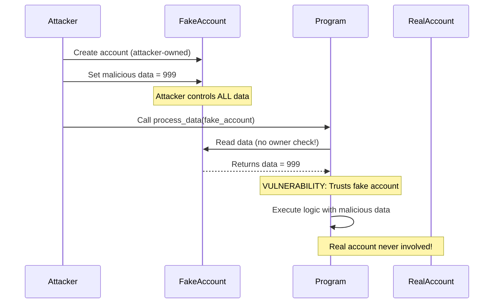

<Note>
**🔴 Security Matrix: Account Validation (Top Right)**

**Frequency:** Common | **Impact:** Critical

*Where most money gets lost. Focus here first.*
</Note>

# Missing Owner Checks

<CardGroup cols={2}>
  <Card title="Severity" icon="exclamation-triangle">
    **Critical** - Allows complete program logic bypass
  </Card>
  <Card title="Difficulty" icon="gauge">
    **Beginner** - Easy to understand and fix
  </Card>
</CardGroup>

## Overview

<Warning>
Missing owner checks allow attackers to create **fake accounts** with malicious data that bypass program logic entirely!
</Warning>

Missing owner checks occur when programs accept accounts without verifying they are actually owned by the program itself. Attackers can craft "lookalike" accounts with identical structure but malicious data, completely subverting program behavior.

## Attack Flow Diagram



## The Vulnerability

<Tabs>
  <Tab title="Anchor">
    ### Vulnerable Implementation

    ```rust filename="programs/owner-checks/vulnerable/anchor/src/lib.rs"
    use anchor_lang::prelude::*;

    #[program]
    pub mod vulnerable_owner {
        use super::*;

        // VULNERABILITY: Accepts UncheckedAccount without owner validation
        pub fn update_data(ctx: Context<UpdateData>, new_value: u64) -> Result<()> {
            let account = &mut ctx.accounts.program_account;

            // DANGER: Reading data from unverified account!
            // This could be a FAKE account owned by the attacker
            let current_value = account.data;

            msg!("Current value: {}", current_value);
            msg!("Updating to: {}", new_value);

            // Business logic based on potentially FAKE data
            account.data = new_value;
            Ok(())
        }
    }

    #[derive(Accounts)]
    pub struct UpdateData<'info> {
        // VULNERABILITY: UncheckedAccount - no owner validation!
        /// CHECK: INTENTIONALLY VULNERABLE - missing owner check
        #[account(mut)]
        pub program_account: UncheckedAccount<'info>,

        pub authority: Signer<'info>,
    }

    #[account]
    pub struct ProgramAccount {
        pub data: u64,
        pub authority: Pubkey,
    }
    ```

    <Accordion title="Why is this vulnerable?">
      The `UncheckedAccount` type doesn't validate ownership. An attacker can:
      1. Create their own account (owned by ANY program they control)
      2. Structure it identically to `ProgramAccount` (discriminator + data + authority)
      3. Set malicious values in their fake account (data = 999)
      4. Pass the fake account to the program
      5. Program deserializes and trusts the FAKE data!

      **Even the discriminator doesn't help** - attackers can replicate it exactly since they control all bytes of their fake account.
    </Accordion>
  </Tab>

  <Tab title="Pinocchio">
    ### Vulnerable Implementation

    ```rust filename="programs/owner-checks/vulnerable/pinocchio/src/lib.rs"
    use pinocchio::prelude::*;

    pub fn update_data(accounts: &[AccountInfo], new_value: u64) -> ProgramResult {
        let [program_account_info, authority_info] = accounts else {
            return Err(ProgramError::NotEnoughAccountKeys);
        };

        // Verify authority signed
        if !authority_info.is_signer() {
            return Err(ProgramError::MissingRequiredSignature);
        }

        // VULNERABILITY: Missing is_owned_by() check!
        // Should verify: program_account_info.is_owned_by(&crate::ID)

        // Read account data (DANGEROUS - could be fake account!)
        let data = program_account_info.try_borrow_mut_data()?;
        let mut account = ProgramAccount::load_mut(&mut data)?;

        // Program trusts data from potentially FAKE account
        let current_value = account.data;
        msg!("Current value: {}", current_value);

        account.data = new_value;
        Ok(())
    }

    #[derive(Copy, Clone)]
    pub struct ProgramAccount {
        pub data: u64,
        pub authority: Pubkey,
    }
    ```

    <Info>
    **Key Difference:** Pinocchio requires explicit `is_owned_by()` checks. Forgetting this single check allows complete program bypass!
    </Info>
  </Tab>
</Tabs>

## Real-World Exploit Demo

<Steps>
  <Step title="Alice creates legitimate account">
    Alice initializes a real account owned by the program with data = 100
  </Step>
  <Step title="Attacker creates fake account">
    Bob creates his own account owned by ANY program he controls (not the target program)
  </Step>
  <Step title="Attacker replicates structure">
    Bob structures his fake account identically: discriminator + data + authority fields
  </Step>
  <Step title="Attacker sets malicious data">
    Bob sets data = 999 (or any value that benefits him) in his fake account
  </Step>
  <Step title="Attacker passes fake account">
    Bob calls update_data() passing his fake account instead of a real one
  </Step>
  <Step title="Program trusts fake data">
    Program reads data = 999 from Bob's fake account and executes logic based on it!
  </Step>
</Steps>

<CodeGroup>
```typescript Test: Exploit Works
// tests/owner-checks.test.ts
it("should allow attacker to use fake account", async () => {
  // Alice creates real account with data = 100
  const realAccount = await program.methods.initialize(new BN(100))
    .accounts({ authority: alice.publicKey })
    .signers([alice])
    .rpc();

  // Attacker creates FAKE account (owned by different program)
  const fakeAccount = Keypair.generate();
  await createFakeAccount(connection, fakeAccount, {
    data: 999,  // Malicious value!
    authority: attacker.publicKey
  });

  // Attacker passes FAKE account to program
  await program.methods.updateData(new BN(500))
    .accounts({
      programAccount: fakeAccount.publicKey,  // FAKE!
      authority: attacker.publicKey
    })
    .signers([attacker])
    .rpc();

  // Program trusted the fake account's data!
  console.log("⚠️  VULNERABILITY: Program processed fake account");
});
```

```bash Expected Output
✓ should allow attacker to use fake account (312ms)

Current value: 999  ← Read from FAKE account!
Updating to: 500

⚠️  VULNERABILITY CONFIRMED: Fake account accepted
```
</CodeGroup>

## Why This Is So Dangerous

<AccordionGroup>
  <Accordion title="Data Validation ≠ Ownership Validation">
    **Common Misconception:** "I'm checking the data structure, so it's safe"

    **Reality:** Attackers control EVERY byte of their fake account:
    - The discriminator (can match yours exactly)
    - All data fields (set to any malicious values)
    - The structure and layout (replicate your account type perfectly)

    The ONLY thing they can't fake is the `owner` field in `AccountInfo`, which Solana's runtime sets based on who actually owns the account.
  </Accordion>

  <Accordion title="Discriminators Don't Protect You">
    Many developers think Anchor's 8-byte discriminator prevents fake accounts.

    **Wrong!** Attackers can:
    1. Read your program's discriminator (it's public on-chain)
    2. Calculate it themselves (SHA256 of "account:YourAccountName")
    3. Copy it byte-for-byte into their fake account

    Discriminators prevent **type confusion** but NOT **fake accounts**.
  </Accordion>

  <Accordion title="Complete Program Logic Bypass">
    Since attackers control all data in fake accounts, they can:
    - Set balances to maximum values
    - Mark themselves as admins
    - Bypass rate limits or cooldown periods
    - Manipulate prices or exchange rates
    - Trigger privileged operations

    Any business logic depending on account data can be subverted.
  </Accordion>
</AccordionGroup>

## The Fix

<Tabs>
  <Tab title="Anchor - Fix #1: Account Type">
    ### Use Account<'info, T> (Recommended)

    ```rust filename="programs/owner-checks/secure/anchor/src/lib.rs"
    #[derive(Accounts)]
    pub struct UpdateData<'info> {
        // FIX: Account<T> type automatically validates ownership
        #[account(mut)]
        pub program_account: Account<'info, ProgramAccount>,

        pub authority: Signer<'info>,
    }
    ```

    <Accordion title="How this prevents the attack">
      The `Account<'info, T>` type forces Anchor to:
      1. Verify `account.owner == crate::ID` BEFORE deserializing
      2. Reject any account not owned by this program
      3. Only deserialize accounts you actually own

      Now attackers **cannot** pass fake accounts - they'll be rejected immediately with `InvalidAccountOwner` error.
    </Accordion>
  </Tab>

  <Tab title="Anchor - Fix #2: Owner Constraint">
    ### Add Owner Constraint

    ```rust
    #[derive(Accounts)]
    pub struct UpdateData<'info> {
        // FIX: Explicit owner constraint
        #[account(
            mut,
            owner = ID
        )]
        pub program_account: UncheckedAccount<'info>,

        pub authority: Signer<'info>,
    }
    ```

    <Note>
    Use this when you need `UncheckedAccount` for some reason but still want owner validation.
    </Note>
  </Tab>

  <Tab title="Anchor - Fix #3: Manual Check">
    ### Manual Validation in Handler

    ```rust
    pub fn update_data(ctx: Context<UpdateData>, new_value: u64) -> Result<()> {
        // FIX: Explicit owner check before using account
        if ctx.accounts.program_account.owner != &crate::ID {
            return Err(ProgramError::InvalidAccountOwner.into());
        }

        // Safe to use account now
        let account = &mut ctx.accounts.program_account;
        account.data = new_value;
        Ok(())
    }
    ```
  </Tab>

  <Tab title="Pinocchio - Secure">
    ### Add is_owned_by() Check

    ```rust filename="programs/owner-checks/secure/pinocchio/src/lib.rs"
    pub fn update_data(accounts: &[AccountInfo], new_value: u64) -> ProgramResult {
        let [program_account_info, authority_info] = accounts else {
            return Err(ProgramError::NotEnoughAccountKeys);
        };

        // FIX: Validate ownership BEFORE reading any data
        if !program_account_info.is_owned_by(&crate::ID) {
            return Err(ProgramError::InvalidAccountOwner);
        }

        // Alternative equivalent check:
        // if program_account_info.owner() != &crate::ID {
        //     return Err(ProgramError::InvalidAccountOwner);
        // }

        // Verify authority signed
        if !authority_info.is_signer() {
            return Err(ProgramError::MissingRequiredSignature);
        }

        // Safe to read account data now - we know we own it
        let data = program_account_info.try_borrow_mut_data()?;
        let mut account = ProgramAccount::load_mut(&mut data)?;

        account.data = new_value;
        Ok(())
    }
    ```

    <Info>
    **Best Practice:** Check ownership BEFORE reading any account data. Place the check as early as possible in your instruction handler.
    </Info>
  </Tab>
</Tabs>

## Framework Comparison

<CodeGroup>
```rust Anchor: Type-Safe
// Anchor does owner checks automatically via type system
#[account(mut)]
pub program_account: Account<'info, ProgramAccount>
// ✅ Owner checked automatically before deserialization
// ✅ Compile-time safety
// ✅ Less code to write
```

```rust Pinocchio: Manual Validation
// Pinocchio requires explicit ownership checks
if !program_account_info.is_owned_by(&crate::ID) {
    return Err(ProgramError::InvalidAccountOwner);
}
// ⚠️  Easy to forget (common bug!)
// ✅ More control
// ✅ Slightly better performance
```
</CodeGroup>

## Testing the Fix

<CodeGroup>
```typescript Test: Exploit Blocked
it("should reject fake account", async () => {
  // Attacker creates FAKE account
  const fakeAccount = Keypair.generate();
  await createFakeAccount(connection, fakeAccount, {
    data: 999,
    authority: attacker.publicKey
  });

  // Attacker tries to pass FAKE account
  try {
    await program.methods.updateData(new BN(500))
      .accounts({
        programAccount: fakeAccount.publicKey,  // FAKE!
        authority: attacker.publicKey
      })
      .signers([attacker])
      .rpc();

    assert.fail("Expected transaction to fail");
  } catch (err) {
    // FIX CONFIRMED: Fake account rejected
    expect(err.toString()).toContain("InvalidAccountOwner");
  }
});
```

```bash Expected Output
✓ should reject fake account (198ms)

Error: AnchorError caused by account: program_account.
Error Code: InvalidAccountOwner.
Error Message: The given account is not owned by the executing program

✅ FIX CONFIRMED: Fake account rejected
```
</CodeGroup>

## Security Checklist

<Note>
Use this checklist when reviewing Solana programs for owner validation:
</Note>

- [ ] All program accounts use `Account<'info, T>` type (Anchor)
- [ ] Or all accounts have explicit `is_owned_by()` checks (Pinocchio)
- [ ] Owner checks happen BEFORE reading any account data
- [ ] No `UncheckedAccount` without corresponding owner validation
- [ ] Tests demonstrate that fake accounts are rejected
- [ ] Code review confirms ownership validation for all account reads

## Real-World Impact

This vulnerability has led to:
- **Complete program logic bypass** - attackers manipulate core business logic
- **Unauthorized access** - fake admin accounts grant elevated privileges
- **Financial losses** - fake balance/price accounts drain funds
- **State corruption** - malicious data corrupts program state

**Why it's so common:**
- Data often "looks valid" (structure matches, discriminator matches)
- Discriminators provide false sense of security
- Not obvious that ownership requires separate validation
- Easy to forget manual checks in Pinocchio

## Resources & Next Steps

<CardGroup cols={3}>
  <Card title="View Source Code" icon="code" href="https://github.com/superteamng/solana-security-reference/tree/main/programs/owner-checks">
    Browse vulnerable and secure implementations
  </Card>
  <Card title="Run Tests" icon="flask" href="https://github.com/superteamng/solana-security-reference/tree/main/tests">
    See fake account exploits demonstrated
  </Card>
  <Card title="Next: Arbitrary CPI" icon="arrow-right" href="/vulnerabilities/arbitrary-cpi">
    Learn about program ID validation attacks
  </Card>
</CardGroup>

<Tip>
**Quick Test:** Try creating a fake account in your local validator and see if your program accepts it. If it does, you have this vulnerability!
</Tip>
