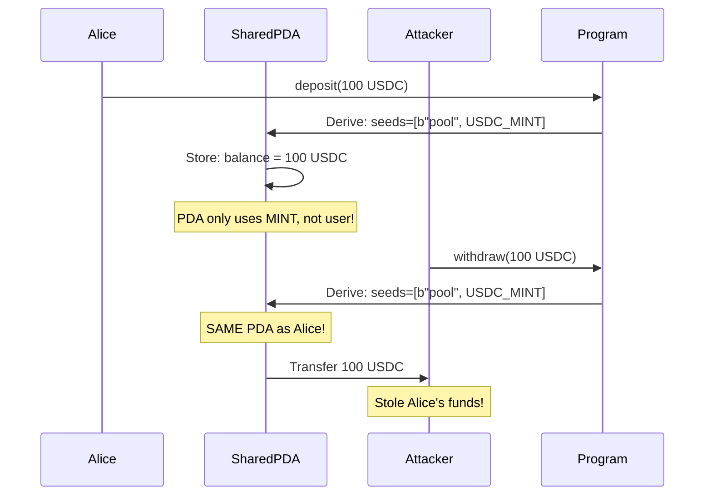

<Note>
**🟡 Security Matrix: PDAs & Arithmetic (Bottom Right)**

**Frequency:** Common | **Impact:** Medium

*Subtle bugs that add up over time.*
</Note>

# PDA Sharing Attacks

<CardGroup cols={2}>
  <Card title="Severity" icon="triangle-exclamation">
    **Medium** - Enables unauthorized access to other users' funds
  </Card>
  <Card title="Difficulty" icon="gauge">
    **Intermediate** - DeFi and PDA derivation knowledge required
  </Card>
</CardGroup>

## Overview

<Warning>
PDA sharing allows attackers to **access other users' funds** by exploiting insufficient seed specificity in PDA derivation!
</Warning>

PDA (Program Derived Address) sharing vulnerabilities occur when programs derive PDAs using only global identifiers (like token mint addresses) without including user-specific seeds. This causes multiple users to share the same PDA authority, allowing attackers to manipulate or steal others' assets.

## Attack Flow Diagram



## The Vulnerability

<Tabs>
  <Tab title="Anchor - Vulnerable">
    ### Insufficient PDA Seeds

    ```rust filename="programs/pda-sharing/vulnerable/anchor/src/instructions/deposit.rs"
    use anchor_lang::prelude::*;
    use anchor_spl::token::{self, Token, TokenAccount};

    pub fn deposit(ctx: Context<Deposit>, amount: u64) -> Result<()> {
        // Transfer tokens from user to pool
        token::transfer(
            CpiContext::new(
                ctx.accounts.token_program.to_account_info(),
                token::Transfer {
                    from: ctx.accounts.user_token_account.to_account_info(),
                    to: ctx.accounts.pool_vault.to_account_info(),
                    authority: ctx.accounts.user.to_account_info(),
                },
            ),
            amount,
        )?;

        // Update pool balance
        let pool = &mut ctx.accounts.pool;
        pool.balance += amount;

        msg!("Deposited {} tokens", amount);
        Ok(())
    }

    #[derive(Accounts)]
    pub struct Deposit<'info> {
        #[account(mut)]
        pub user: Signer<'info>,

        // VULNERABILITY: Seeds only include mint, not user!
        // All users depositing the same token share ONE pool
        #[account(
            init_if_needed,
            payer = user,
            space = 8 + Pool::INIT_SPACE,
            seeds = [b"pool", mint.key().as_ref()],  // ❌ Missing user.key()!
            bump,
        )]
        pub pool: Account<'info, Pool>,

        #[account(
            init_if_needed,
            payer = user,
            seeds = [b"vault", mint.key().as_ref()],  // ❌ Missing user.key()!
            bump,
            token::mint = mint,
            token::authority = pool,
        )]
        pub pool_vault: Account<'info, TokenAccount>,

        #[account(mut)]
        pub user_token_account: Account<'info, TokenAccount>,

        pub mint: Account<'info, Mint>,
        pub token_program: Program<'info, Token>,
        pub system_program: Program<'info, System>,
    }

    #[account]
    pub struct Pool {
        pub balance: u64,
        pub mint: Pubkey,
    }
    ```

    <Accordion title="Why is this vulnerable?">
      **The problem:**
      - PDA seeds: `[b"pool", mint.key()]` - only mint address
      - All users of USDC → same pool PDA
      - All users of SOL → same pool PDA
      - No per-user isolation!

      **What happens:**
      1. Alice deposits 100 USDC → pool PDA balance = 100
      2. Bob deposits 50 USDC → **same** pool PDA balance = 150
      3. Bob withdraws 150 USDC → drains Alice's + his own funds!

      Alice and Bob are using the same pool/vault because the PDA derivation doesn't include user identity.
    </Accordion>
  </Tab>

  <Tab title="Pinocchio - Vulnerable">
    ### Global PDA Without User Specificity

    ```rust filename="programs/pda-sharing/vulnerable/pinocchio/src/lib.rs"
    pub fn deposit(accounts: &[AccountInfo], amount: u64) -> ProgramResult {
        let [
            user_info,
            pool_info,
            pool_vault_info,
            user_token_info,
            mint_info,
            token_program_info,
        ] = accounts else {
            return Err(ProgramError::NotEnoughAccountKeys);
        };

        // VULNERABILITY: PDA derived from only mint address
        // seeds = [b"pool", mint.key()]
        // All users share the same pool!

        // Derive pool PDA (missing user in seeds!)
        let (pool_pda, _bump) = Pubkey::find_program_address(
            &[b"pool", mint_info.key().as_ref()],
            &crate::ID,
        );

        if pool_info.key() != &pool_pda {
            return Err(ProgramError::InvalidSeeds);
        }

        // Transfer tokens to shared vault
        // Multiple users deposit to SAME vault!
        transfer_tokens(user_token_info, pool_vault_info, amount)?;

        // Update balance in shared pool
        let mut pool_data = pool_info.try_borrow_mut_data()?;
        let mut pool = Pool::load_mut(&mut pool_data)?;
        pool.balance += amount;

        Ok(())
    }
    ```

    <Info>
    Pinocchio gives you full control over PDA derivation, but you **must** include user-specific seeds for per-user isolation.
    </Info>
  </Tab>
</Tabs>

## Real-World Exploit Demo

<Steps>
  <Step title="Alice deposits 100 USDC">
    Alice calls deposit() with 100 USDC. Pool PDA derived: `[b"pool", USDC_MINT]`
  </Step>
  <Step title="Bob deposits 50 USDC">
    Bob calls deposit() with 50 USDC. **Same pool PDA** derived (only mint in seeds)
  </Step>
  <Step title="Pool holds 150 USDC total">
    Alice's 100 + Bob's 50 = 150 USDC in shared vault
  </Step>
  <Step title="Bob withdraws 150 USDC">
    Bob calls withdraw(150). Program checks pool balance ✓ (has 150). Transfer succeeds!
  </Step>
  <Step title="Alice's funds stolen">
    Bob withdrew all 150 USDC, including Alice's 100 USDC deposit
  </Step>
</Steps>

<CodeGroup>
```typescript Test: Exploit Works
it("should allow attacker to drain shared pool", async () => {
  // Alice deposits 100 USDC
  await program.methods.deposit(new BN(100))
    .accounts({
      user: alice.publicKey,
      mint: usdcMint,
    })
    .signers([alice])
    .rpc();

  // Bob deposits 50 USDC to SAME pool (only mint in seeds)
  await program.methods.deposit(new BN(50))
    .accounts({
      user: attacker.publicKey,
      mint: usdcMint,  // Same mint = same pool!
    })
    .signers([attacker])
    .rpc();

  // Pool balance = 150 (Alice's 100 + Bob's 50)
  const poolPda = derivePoolPda(usdcMint);  // seeds=[b"pool", mint]
  const pool = await program.account.pool.fetch(poolPda);
  expect(pool.balance).toEqual(150);

  // Bob withdraws ALL 150 USDC (including Alice's!)
  await program.methods.withdraw(new BN(150))
    .accounts({
      user: attacker.publicKey,
      mint: usdcMint,
    })
    .signers([attacker])
    .rpc();

  // Alice's funds stolen!
  console.log("⚠️  Attacker drained shared pool!");
});
```

```bash Expected Output
✓ should allow attacker to drain shared pool (567ms)

Alice deposited: 100 USDC
Bob deposited: 50 USDC
Pool balance: 150 USDC (shared!)
Bob withdrew: 150 USDC

⚠️  VULNERABILITY: Attacker drained shared pool
```
</CodeGroup>

## Why This Happens

<AccordionGroup>
  <Accordion title="Insufficient Seed Specificity">
    **Vulnerable seeds:**
    ```rust
    seeds = [b"pool", mint.key()]
    ```

    This creates **one pool per token mint**, not one pool per user per mint.

    **Result:** All USDC users → 1 shared pool, All SOL users → 1 shared pool

    **Problem:** No way to distinguish Alice's pool from Bob's pool!
  </Accordion>

  <Accordion title="Missing Access Control">
    Even with shared pools, proper access control could prevent attacks:
    ```rust
    // Missing validation:
    require!(pool.owner == user.key(), ErrorCode::Unauthorized);
    ```

    But relying on runtime checks is fragile. **Use user-specific seeds instead!**
  </Accordion>

  <Accordion title="When PDA Sharing Is Intentional">
    Sometimes shared PDAs are desired (e.g., global liquidity pools, shared vaults).

    **Safe when:**
    - Proper accounting tracks individual user contributions
    - Withdrawals proportional to deposits
    - Additional access controls validate ownership

    **Example:** AMM liquidity pools with LP tokens proving user share.
  </Accordion>
</AccordionGroup>

## The Fix

<Tabs>
  <Tab title="Anchor - Fix: User-Specific Seeds">
    ### Include User Pubkey in Seeds

    ```rust filename="programs/pda-sharing/secure/anchor/src/instructions/deposit.rs"
    #[derive(Accounts)]
    pub struct Deposit<'info> {
        #[account(mut)]
        pub user: Signer<'info>,

        // FIX: Seeds include BOTH user and mint
        // Each user gets their own pool per token type
        #[account(
            init_if_needed,
            payer = user,
            space = 8 + Pool::INIT_SPACE,
            seeds = [
                b"pool",
                user.key().as_ref(),  // ✅ User-specific!
                mint.key().as_ref(),
            ],
            bump,
        )]
        pub pool: Account<'info, Pool>,

        // FIX: Vault also user-specific
        #[account(
            init_if_needed,
            payer = user,
            seeds = [
                b"vault",
                user.key().as_ref(),  // ✅ User-specific!
                mint.key().as_ref(),
            ],
            bump,
            token::mint = mint,
            token::authority = pool,
        )]
        pub pool_vault: Account<'info, TokenAccount>,

        #[account(mut)]
        pub user_token_account: Account<'info, TokenAccount>,

        pub mint: Account<'info, Mint>,
        pub token_program: Program<'info, Token>,
        pub system_program: Program<'info, System>,
    }
    ```

    <Accordion title="How this prevents PDA sharing">
      Now each user-mint combination creates a **unique PDA**:
      - Alice's USDC pool: `[b"pool", alice.key(), USDC_MINT]`
      - Bob's USDC pool: `[b"pool", bob.key(), USDC_MINT]`

      **Bob cannot access Alice's pool** - different PDA addresses!
    </Accordion>
  </Tab>

  <Tab title="Pinocchio - Secure">
    ### Include User in PDA Derivation

    ```rust filename="programs/pda-sharing/secure/pinocchio/src/lib.rs"
    pub fn deposit(accounts: &[AccountInfo], amount: u64) -> ProgramResult {
        let [
            user_info,
            pool_info,
            pool_vault_info,
            user_token_info,
            mint_info,
            token_program_info,
        ] = accounts else {
            return Err(ProgramError::NotEnoughAccountKeys);
        };

        // FIX: PDA derived with user + mint
        let (pool_pda, _bump) = Pubkey::find_program_address(
            &[
                b"pool",
                user_info.key().as_ref(),  // ✅ User-specific!
                mint_info.key().as_ref(),
            ],
            &crate::ID,
        );

        if pool_info.key() != &pool_pda {
            return Err(ProgramError::InvalidSeeds);
        }

        // Each user has their own isolated pool
        transfer_tokens(user_token_info, pool_vault_info, amount)?;

        let mut pool_data = pool_info.try_borrow_mut_data()?;
        let mut pool = Pool::load_mut(&mut pool_data)?;
        pool.balance += amount;

        Ok(())
    }
    ```

    <Info>
    **Best Practice:** Always include user identity in PDA seeds for user-specific accounts. Use `[b"prefix", user.key(), resource.key()]` pattern.
    </Info>
  </Tab>
</Tabs>

## Testing the Fix

<CodeGroup>
```typescript Test: PDA Isolation
it("should create separate pools per user", async () => {
  // Alice deposits to HER pool
  await program.methods.deposit(new BN(100))
    .accounts({ user: alice.publicKey, mint: usdcMint })
    .signers([alice])
    .rpc();

  // Bob deposits to HIS pool (different PDA!)
  await program.methods.deposit(new BN(50))
    .accounts({ user: attacker.publicKey, mint: usdcMint })
    .signers([attacker])
    .rpc();

  // Pools are SEPARATE
  const alicePoolPda = derivePoolPda(alice.publicKey, usdcMint);
  const bobPoolPda = derivePoolPda(attacker.publicKey, usdcMint);

  expect(alicePoolPda).not.toEqual(bobPoolPda);  // Different PDAs!

  const alicePool = await program.account.pool.fetch(alicePoolPda);
  const bobPool = await program.account.pool.fetch(bobPoolPda);

  expect(alicePool.balance).toEqual(100);  // Alice's balance
  expect(bobPool.balance).toEqual(50);     // Bob's balance

  // Bob CANNOT withdraw from Alice's pool
  try {
    await program.methods.withdraw(new BN(100))
      .accounts({ user: attacker.publicKey, mint: usdcMint })
      .remainingAccounts([{ pubkey: alicePoolPda, ...}])  // Try Alice's pool
      .signers([attacker])
      .rpc();

    assert.fail("Expected transaction to fail");
  } catch (err) {
    expect(err.toString()).toContain("InvalidSeeds");
  }
});
```

```bash Expected Output
✓ should create separate pools per user (423ms)

Alice's pool: CxK... (balance: 100)
Bob's pool: 8mQ... (balance: 50)
✅ FIX CONFIRMED: Pools are isolated
```
</CodeGroup>

## Security Checklist

- [ ] All user-specific PDAs include user pubkey in seeds
- [ ] PDA derivation uses `[b"prefix", user.key(), resource.key()]` pattern
- [ ] Tests verify users cannot access each other's PDAs
- [ ] Shared PDAs only used intentionally with proper accounting
- [ ] Withdraw functions validate user owns the PDA

## Resources & Next Steps

<CardGroup cols={3}>
  <Card title="View Source Code" icon="code" href="https://github.com/superteamng/solana-security-reference/tree/main/programs/pda-sharing">
    Browse vulnerable and secure PDA implementations
  </Card>
  <Card title="Run Tests" icon="flask" href="https://github.com/superteamng/solana-security-reference/tree/main/tests">
    See PDA sharing attacks demonstrated
  </Card>
  <Card title="Framework Comparison" icon="scale-balanced" href="/comparisons/anchor-vs-pinocchio">
    Compare Anchor vs Pinocchio security approaches
  </Card>
</CardGroup>

<Tip>
**Design Pattern:** Always use `[b"resource_type", user.key(), resource_identifier.key()]` for user-owned PDAs to ensure isolation.
</Tip>
