<Note>
**🟢 Security Matrix: Rust & Lifecycle (Bottom Left)**

**Frequency:** Rare | **Impact:** Low-Medium

*Rust helps prevent most of these, but lifecycle issues remain.*
</Note>

# Reinitialization Attacks

<CardGroup cols={2}>
  <Card title="Severity" icon="circle-exclamation">
    **High** - Allows complete account takeover and asset theft
  </Card>
  <Card title="Difficulty" icon="gauge">
    **Intermediate** - Account lifecycle understanding required
  </Card>
</CardGroup>

## Overview

<Warning>
Reinitialization attacks allow attackers to **overwrite existing accounts**, hijacking control of valuable vaults, escrows, and asset-holding accounts!
</Warning>

Reinitialization vulnerabilities occur when programs fail to check if an account has already been initialized. Attackers can call the initialization function on existing accounts, overwriting the authority field and stealing control of funds.

## Attack Flow Diagram

```mermaid
sequenceDiagram
    participant Alice
    participant VaultAccount
    participant Attacker
    participant Program

    Alice->>Program: initialize_vault(alice_authority)
    Program->>VaultAccount: Create: authority = Alice, balance = 1000 SOL
    Note over VaultAccount: ✅ Legitimate vault

    Attacker->>Program: initialize_vault(attacker_authority)
    Note over Attacker: Calls init on EXISTING vault!
    Program->>VaultAccount: ❌ No initialization check
    Program->>VaultAccount: Overwrite: authority = Attacker
    Note over VaultAccount: 💀 Alice's vault hijacked!
    Attacker->>VaultAccount: withdraw(1000 SOL)
    Note over Attacker: Steals all funds!
```



## The Vulnerability

<Tabs>
  <Tab title="Anchor - Vulnerable">
    ### Missing Initialization Check

    ```rust filename="programs/reinitialization-attacks/vulnerable/anchor/src/instructions/unsafe_initialize.rs"
    use anchor_lang::prelude::*;
    use crate::state::Vault;

    pub fn unsafe_initialize(ctx: Context<UnsafeInitialize>) -> Result<()> {
        let vault = &mut ctx.accounts.vault;

        // VULNERABILITY: No check if vault is already initialized!
        // Attacker can call this on existing vaults and overwrite authority
        vault.authority = ctx.accounts.authority.key();
        vault.balance = 0;

        msg!("Vault initialized with authority: {}", vault.authority);
        Ok(())
    }

    #[derive(Accounts)]
    pub struct UnsafeInitialize<'info> {
        #[account(mut)]
        pub authority: Signer<'info>,

        // VULNERABILITY: Using 'zero' constraint without 'init'
        // This allows the account to be passed multiple times!
        #[account(
            mut,
            seeds = [b"vault", authority.key().as_ref()],
            bump,
        )]
        pub vault: Account<'info, Vault>,

        pub system_program: Program<'info, System>,
    }
    ```

    <Accordion title="Why is this vulnerable?">
      **The problem:**
      - No `init` constraint means Anchor doesn't enforce one-time initialization
      - No manual initialization flag check
      - Attacker can call this function on Alice's existing vault
      - Authority field gets overwritten to attacker's address

      **What should happen:** Anchor's `init` constraint automatically prevents reinitialization.
    </Accordion>
  </Tab>

  <Tab title="Pinocchio - Vulnerable">
    ### Missing Discriminator/Flag Check

    ```rust filename="programs/reinitialization-attacks/vulnerable/pinocchio/src/lib.rs"
    pub fn unsafe_initialize(accounts: &[AccountInfo]) -> ProgramResult {
        let [authority_info, vault_info, system_program_info] = accounts else {
            return Err(ProgramError::NotEnoughAccountKeys);
        };

        if !authority_info.is_signer() {
            return Err(ProgramError::MissingRequiredSignature);
        }

        // VULNERABILITY: No check if vault is already initialized!
        // Missing: if vault_data[0] != 0 { return Err(...) }

        let mut vault_data = vault_info.try_borrow_mut_data()?;

        // Directly overwrites data without checking initialization status
        // vault_data[0] = discriminator (should check this first!)
        vault_data[1..33].copy_from_slice(authority_info.key().as_ref());
        // ... set balance to 0 ...

        Ok(())
    }
    ```

    <Info>
    Pinocchio requires **manual discriminator checks** to prevent reinitialization. Always verify the account is uninitialized before writing data!
    </Info>
  </Tab>
</Tabs>

## Real-World Exploit Demo

<Steps>
  <Step title="Alice initializes vault with 1000 SOL">
    Alice creates a legitimate vault account, depositing funds with herself as authority
  </Step>
  <Step title="Attacker discovers Alice's vault">
    Bob finds Alice's vault PDA address (derived from her public key)
  </Step>
  <Step title="Attacker calls initialize on existing vault">
    Bob calls the initialization function, passing Alice's existing vault account
  </Step>
  <Step title="Program overwrites authority">
    Program has no initialization check, so it overwrites Alice's authority with Bob's
  </Step>
  <Step title="Attacker withdraws all funds">
    Bob now controls the vault and withdraws all 1000 SOL
  </Step>
</Steps>

<CodeGroup>
```typescript Test: Exploit Works
it("should allow attacker to reinitialize victim's vault", async () => {
  // Alice initializes vault with 1000 SOL
  await program.methods.unsafeInitialize()
    .accounts({
      authority: alice.publicKey,
      vault: aliceVaultPda,
    })
    .signers([alice])
    .rpc();

  await program.methods.deposit(new BN(1000))
    .accounts({ vault: aliceVaultPda })
    .signers([alice])
    .rpc();

  // Attacker calls initialize AGAIN on Alice's vault
  await program.methods.unsafeInitialize()
    .accounts({
      authority: attacker.publicKey,
      vault: aliceVaultPda,  // Alice's existing vault!
    })
    .signers([attacker])
    .rpc();

  // Attacker now controls Alice's vault
  const vault = await program.account.vault.fetch(aliceVaultPda);
  expect(vault.authority).toEqual(attacker.publicKey);

  // Attacker steals all funds
  await program.methods.withdraw(new BN(1000))
    .accounts({ vault: aliceVaultPda })
    .signers([attacker])
    .rpc();
});
```

```bash Expected Output
✓ should allow attacker to reinitialize victim's vault (456ms)

Vault initialized with authority: <Alice's key>
Deposited: 1000 SOL
Vault initialized with authority: <Attacker's key>  ← REINITIALIZATION!
Withdrawn: 1000 SOL

⚠️  VULNERABILITY: Attacker hijacked existing vault
```
</CodeGroup>

## The Fix

<Tabs>
  <Tab title="Anchor - Fix #1: Init Constraint">
    ### Use 'init' Constraint (Recommended)

    ```rust filename="programs/reinitialization-attacks/secure/anchor/src/instructions/initialize.rs"
    #[derive(Accounts)]
    pub struct Initialize<'info> {
        #[account(mut)]
        pub authority: Signer<'info>,

        // FIX: 'init' constraint prevents reinitialization automatically
        #[account(
            init,
            payer = authority,
            space = 8 + Vault::INIT_SPACE,
            seeds = [b"vault", authority.key().as_ref()],
            bump,
        )]
        pub vault: Account<'info, Vault>,

        pub system_program: Program<'info, System>,
    }
    ```

    <Accordion title="How 'init' prevents reinitialization">
      Anchor's `init` constraint enforces:
      1. Account must not already exist or must have zero data
      2. Allocates and assigns account to the program
      3. Sets the discriminator automatically
      4. Transaction fails if account is already initialized

      **Cannot be called twice on the same account!**
    </Accordion>
  </Tab>

  <Tab title="Anchor - Fix #2: Init-If-Needed">
    ### Use 'init_if_needed' with Caution

    ```rust
    // Use only when you genuinely need idempotent initialization
    #[account(
        init_if_needed,
        payer = authority,
        space = 8 + Vault::INIT_SPACE,
        seeds = [b"vault", authority.key().as_ref()],
        bump,
    )]
    pub vault: Account<'info, Vault>,
    ```

    <Warning>
    `init_if_needed` allows reinitialization by design. Only use when you have additional logic to preserve existing data or when idempotency is required.
    </Warning>
  </Tab>

  <Tab title="Anchor - Fix #3: Manual Check">
    ### Manual Initialization Flag

    ```rust
    #[account]
    pub struct Vault {
        pub is_initialized: bool,  // Initialization flag
        pub authority: Pubkey,
        pub balance: u64,
    }

    pub fn initialize(ctx: Context<Initialize>) -> Result<()> {
        let vault = &mut ctx.accounts.vault;

        // FIX: Check initialization flag
        if vault.is_initialized {
            return Err(ErrorCode::AlreadyInitialized.into());
        }

        vault.is_initialized = true;
        vault.authority = ctx.accounts.authority.key();
        vault.balance = 0;

        Ok(())
    }
    ```
  </Tab>

  <Tab title="Pinocchio - Secure">
    ### Check Discriminator Before Writing

    ```rust filename="programs/reinitialization-attacks/secure/pinocchio/src/lib.rs"
    pub fn initialize(accounts: &[AccountInfo]) -> ProgramResult {
        let [authority_info, vault_info, system_program_info] = accounts else {
            return Err(ProgramError::NotEnoughAccountKeys);
        };

        if !authority_info.is_signer() {
            return Err(ProgramError::MissingRequiredSignature);
        }

        let mut vault_data = vault_info.try_borrow_mut_data()?;

        // FIX: Check if account is already initialized
        // Discriminator is the first 8 bytes
        // If non-zero, account is already initialized
        if vault_data[0] != 0 {
            return Err(ProgramError::AccountAlreadyInitialized);
        }

        // Safe to initialize now
        vault_data[0] = VAULT_DISCRIMINATOR;
        vault_data[1..33].copy_from_slice(authority_info.key().as_ref());
        // ... initialize balance ...

        Ok(())
    }
    ```

    <Info>
    **Best Practice:** Check discriminator (first byte or first 8 bytes) before ANY data writes in initialization functions.
    </Info>
  </Tab>
</Tabs>

## Testing the Fix

<CodeGroup>
```typescript Test: Reinitialization Blocked
it("should prevent reinitialization of existing vault", async () => {
  // Alice initializes vault
  await program.methods.initialize()
    .accounts({
      authority: alice.publicKey,
      vault: aliceVaultPda,
    })
    .signers([alice])
    .rpc();

  // Attacker tries to reinitialize
  try {
    await program.methods.initialize()
      .accounts({
        authority: attacker.publicKey,
        vault: aliceVaultPda,  // Existing vault
      })
      .signers([attacker])
      .rpc();

    assert.fail("Expected transaction to fail");
  } catch (err) {
    // FIX CONFIRMED: Reinitialization prevented
    expect(err.toString()).toContain("AlreadyInUse");
  }

  // Verify Alice still owns vault
  const vault = await program.account.vault.fetch(aliceVaultPda);
  expect(vault.authority).toEqual(alice.publicKey);
});
```

```bash Expected Output
✓ should prevent reinitialization of existing vault (289ms)

Error: Account allocation already in use
✅ FIX CONFIRMED: Reinitialization prevented
```
</CodeGroup>

## Security Checklist

- [ ] All initialization functions use `init` constraint (Anchor)
- [ ] Or manual discriminator/flag checks (Pinocchio)
- [ ] Tests verify reinitialization attempts fail
- [ ] No direct data overwrites without initialization checks
- [ ] `init_if_needed` only used when genuinely needed

## Real-World Impact

This vulnerability has led to:
- **Complete account takeovers** - attackers steal control of vaults/escrows
- **Asset theft** - billions in locked funds become accessible to attackers
- **Protocol manipulation** - admin accounts get hijacked

**High-profile examples:**
- Escrow programs without init checks
- Vault programs allowing authority overwrites
- Staking pools with reinitialization vulnerabilities

## Resources & Next Steps

<CardGroup cols={3}>
  <Card title="View Source Code" icon="code" href="https://github.com/superteamng/solana-security-reference/tree/main/programs/reinitialization-attacks">
    Browse vulnerable and secure implementations
  </Card>
  <Card title="Run Tests" icon="flask" href="https://github.com/superteamng/solana-security-reference/tree/main/tests">
    See reinitialization attacks demonstrated
  </Card>
  <Card title="Next: Type Cosplay" icon="arrow-right" href="/vulnerabilities/type-cosplay">
    Learn about account type confusion attacks
  </Card>
</CardGroup>
