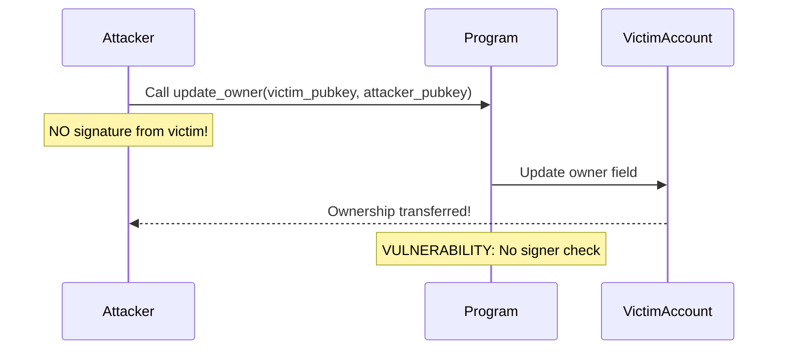

<Note>
**🔴 Security Matrix: Account Validation (Top Right)**

**Frequency:** Common | **Impact:** Critical

*Where most money gets lost. Focus here first.*
</Note>

# Missing Signer Checks

<CardGroup cols={2}>
  <Card title="Severity" icon="exclamation-triangle">
    **Critical** - Allows unauthorized account modifications
  </Card>
  <Card title="Difficulty" icon="gauge">
    **Beginner** - Easy to understand and fix
  </Card>
</CardGroup>

## Overview

<Warning>
This is the **#1 most common** Solana security vulnerability. Always validate signers!
</Warning>

Missing signer checks occur when programs accept accounts without verifying the transaction was actually signed by the account owner. This allows attackers to modify accounts they don't control.

## Attack Flow Diagram



## The Vulnerability

<Tabs>
  <Tab title="Anchor">
    ### Vulnerable Implementation

    ```rust filename="programs/signer-checks/vulnerable/anchor/src/lib.rs"
    use anchor_lang::prelude::*;

    #[program]
    pub mod vulnerable_signer {
        use super::*;

        // VULNERABILITY: owner is UncheckedAccount - no signer validation!
        pub fn update_owner(ctx: Context<UpdateOwnership>) -> Result<()> {
            ctx.accounts.program_account.owner = ctx.accounts.new_owner.key();
            Ok(())
        }
    }

    #[derive(Accounts)]
    pub struct UpdateOwnership<'info> {
        // VULNERABILITY: This accepts ANY public key, doesn't verify signature
        /// CHECK: INTENTIONALLY VULNERABLE
        pub owner: UncheckedAccount<'info>,

        #[account(mut, has_one = owner)]
        pub program_account: Account<'info, ProgramAccount>,

        /// CHECK: This is the new owner being set
        pub new_owner: UncheckedAccount<'info>,
    }

    #[account]
    pub struct ProgramAccount {
        pub owner: Pubkey,
    }
    ```

    <Accordion title="Why is this vulnerable?">
      The `UncheckedAccount` type doesn't validate signatures. An attacker can:
      1. Read the current owner's pubkey from the account data
      2. Pass that pubkey as the `owner` parameter
      3. Execute the transaction WITHOUT the owner's signature
      4. The `has_one = owner` check passes (data matches), but no signature verified!
    </Accordion>
  </Tab>

  <Tab title="Pinocchio">
    ### Vulnerable Implementation

    ```rust filename="programs/signer-checks/vulnerable/pinocchio/src/lib.rs"
    fn update_owner(accounts: &[AccountInfo]) -> ProgramResult {
        let [owner_info, program_account_info, new_owner_info] = accounts else {
            return Err(ProgramError::NotEnoughAccountKeys);
        };

        // Read stored owner from account data
        let stored_owner = Pubkey::from(/* ... */);

        // VULNERABILITY: Checks data matches but NOT that owner signed!
        if stored_owner != *owner_info.key() {
            return Err(ProgramError::InvalidAccountData);
        }

        // MISSING: Should check owner_info.is_signer() here!

        // Update owner in account data
        data[1..33].copy_from_slice(new_owner_info.key().as_ref());
        Ok(())
    }
    ```

    <Info>
    **Key Difference:** Pinocchio requires explicit `is_signer()` checks. Forgetting this check is easy and dangerous!
    </Info>
  </Tab>
</Tabs>

## Real-World Exploit Demo

<Steps>
  <Step title="Setup victim account">
    Create an account owned by Alice with valuable state/permissions
  </Step>
  <Step title="Attacker reads on-chain data">
    Attacker queries the account and reads Alice's pubkey from account data
  </Step>
  <Step title="Execute attack transaction">
    Attacker crafts transaction passing Alice's pubkey but doesn't obtain her signature
  </Step>
  <Step title="Ownership stolen">
    Program updates owner field to attacker's address - Alice loses control!
  </Step>
</Steps>

<CodeGroup>
```typescript Test: Exploit Works
// tests/signer-checks.test.ts
it("should allow attacker to steal ownership", async () => {
  // Alice creates her account
  await program.methods.initialize()
    .accounts({ owner: alice.publicKey })
    .signers([alice])
    .rpc();

  // Attacker steals it WITHOUT Alice's signature!
  await program.methods.updateOwner()
    .accounts({
      owner: alice.publicKey,          // Attacker passes Alice's key
      newOwner: attacker.publicKey,    // But signs with attacker's key
    })
    .signers([attacker])               // Alice didn't sign!
    .rpc();

  // Attacker now owns Alice's account
  const account = await program.account.programAccount.fetch(aliceAccountPda);
  expect(account.owner).toEqual(attacker.publicKey);
});
```

```bash Expected Output
✓ should allow attacker to steal ownership (234ms)

⚠️  VULNERABILITY CONFIRMED: Exploit succeeded
```
</CodeGroup>

## The Fix

<Tabs>
  <Tab title="Anchor - Fix #1: Signer Type">
    ### Use the Signer Account Type (Recommended)

    ```rust filename="programs/signer-checks/secure/anchor/src/lib.rs"
    #[derive(Accounts)]
    pub struct UpdateOwnership<'info> {
        // FIX: Signer type enforces signature validation
        pub owner: Signer<'info>,

        #[account(mut, has_one = owner)]
        pub program_account: Account<'info, ProgramAccount>,

        /// CHECK: New owner being set
        pub new_owner: UncheckedAccount<'info>,
    }
    ```

    <Accordion title="How this prevents the attack">
      The `Signer` type forces Anchor to verify:
      1. The account signed the transaction
      2. The signature is cryptographically valid
      3. The signature matches the public key

      Now attackers **cannot** pass Alice's key without her actual signature.
    </Accordion>
  </Tab>

  <Tab title="Anchor - Fix #2: Constraint">
    ### Add signer Constraint

    ```rust
    #[derive(Accounts)]
    pub struct UpdateOwnership<'info> {
        // FIX: Explicit signer constraint
        #[account(signer)]
        pub owner: UncheckedAccount<'info>,

        #[account(mut, has_one = owner)]
        pub program_account: Account<'info, ProgramAccount>,

        /// CHECK: New owner
        pub new_owner: UncheckedAccount<'info>,
    }
    ```
  </Tab>

  <Tab title="Anchor - Fix #3: Manual Check">
    ### Manual Validation in Handler

    ```rust
    pub fn update_owner(ctx: Context<UpdateOwnership>) -> Result<()> {
        // FIX: Explicit signer check in instruction logic
        if !ctx.accounts.owner.is_signer {
            return Err(ProgramError::MissingRequiredSignature.into());
        }

        ctx.accounts.program_account.owner = ctx.accounts.new_owner.key();
        Ok(())
    }
    ```
  </Tab>

  <Tab title="Pinocchio - Secure">
    ### Add is_signer() Check

    ```rust filename="programs/signer-checks/secure/pinocchio/src/lib.rs"
    fn update_owner(accounts: &[AccountInfo]) -> ProgramResult {
        let [owner_info, program_account_info, new_owner_info] = accounts else {
            return Err(ProgramError::NotEnoughAccountKeys);
        };

        // FIX: Validate signer BEFORE accepting the account
        if !owner_info.is_signer() {
            return Err(ProgramError::MissingRequiredSignature);
        }

        // Read stored owner
        let stored_owner = Pubkey::from(/* ... */);

        // Verify data matches
        if stored_owner != *owner_info.key() {
            return Err(ProgramError::InvalidAccountData);
        }

        // Safe to update now
        data[1..33].copy_from_slice(new_owner_info.key().as_ref());
        Ok(())
    }
    ```

    <Info>
    **Key Difference:** Anchor handles this automatically with `Signer` type, but Pinocchio requires explicit manual checks. This is the security tradeoff of low-level development.
    </Info>
  </Tab>
</Tabs>

## Framework Comparison

<AccordionGroup>
  <Accordion title="Anchor: Type-Safe by Default">
    - Uses `Signer<'info>` type to enforce signature validation
    - Compiler errors if you try to use account without proper type
    - Multiple ways to validate: type, constraint, or manual check
    - **Trade-off:** Slight overhead from type system
  </Accordion>

  <Accordion title="Pinocchio: Manual Validation Required">
    - Requires explicit `is_signer()` calls
    - Easy to forget (common source of bugs)
    - More verbose but complete control
    - **Trade-off:** Better performance, more dangerous
  </Accordion>
</AccordionGroup>

## Testing the Fix

<CodeGroup>
```typescript Test: Exploit Blocked
it("should prevent attacker from stealing ownership", async () => {
  // Alice creates her account
  await program.methods.initialize()
    .accounts({ owner: alice.publicKey })
    .signers([alice])
    .rpc();

  // Attacker attempts to steal WITHOUT Alice's signature
  try {
    await program.methods.updateOwner()
      .accounts({
        owner: alice.publicKey,
        newOwner: attacker.publicKey,
      })
      .signers([attacker])  // Missing Alice's signature
      .rpc();

    assert.fail("Expected transaction to fail");
  } catch (err) {
    // FIX CONFIRMED: Transaction rejected due to missing signature
    expect(err.toString()).toContain("missing required signature");
  }
});
```

```bash Expected Output
✓ should prevent attacker from stealing ownership (187ms)

✅ FIX CONFIRMED: Exploit blocked by signature validation
```
</CodeGroup>

## Security Checklist

<Note>
Use this checklist when reviewing Solana programs for signer validation:
</Note>

- [ ] All accounts that authorize actions use `Signer` type (Anchor)
- [ ] Or all critical accounts have `is_signer()` checks (Pinocchio)
- [ ] No `UncheckedAccount` types for authority figures
- [ ] Tests demonstrate that unsigned transactions fail
- [ ] Code review confirms signature validation happens before state changes

## Resources & Next Steps

<CardGroup cols={3}>
  <Card title="View Source Code" icon="code" href="https://github.com/superteamng/solana-security-reference/tree/main/programs/signer-checks">
    Browse the complete vulnerable and secure implementations
  </Card>
  <Card title="Run Tests" icon="flask" href="https://github.com/superteamng/solana-security-reference/tree/main/tests">
    See the exploit and fix demonstrated in automated tests
  </Card>
  <Card title="Next: Owner Checks" icon="arrow-right" href="/vulnerabilities/owner-checks">
    Learn about another critical validation vulnerability
  </Card>
</CardGroup>

<Tip>
Want to practice? Fork the repository and try breaking/fixing the code yourself!
</Tip>
