<Note>
**🔴 Security Matrix: Account Validation (Top Right)**

**Frequency:** Common | **Impact:** Critical

*Where most money gets lost. Focus here first.*
</Note>

# Type Cosplay Attacks

<CardGroup cols={2}>
  <Card title="Severity" icon="triangle-exclamation">
    **Medium** - Enables privilege escalation via account type confusion
  </Card>
  <Card title="Difficulty" icon="gauge">
    **Advanced** - Requires understanding discriminators and memory layouts
  </Card>
</CardGroup>

## Overview

<Warning>
Type cosplay attacks allow attackers to **masquerade low-privilege accounts as high-privilege ones**, bypassing authorization checks!
</Warning>

Type cosplay vulnerabilities occur when programs fail to validate account discriminators, allowing attackers to substitute accounts with identical memory layouts but different intended purposes. A User account can impersonate an Admin account, gaining elevated privileges.

## Attack Flow Diagram

```mermaid
sequenceDiagram
    participant Attacker
    participant UserAccount
    participant Program
    participant PrivilegedOp

    Attacker->>UserAccount: Create (privilege_level = 1)
    Note over UserAccount: Legitimate USER account
    Attacker->>Program: admin_operation(user_account)
    Note over Attacker: Passes USER as ADMIN!
    Program->>UserAccount: Check owner ✓
    Program->>UserAccount: Check authority ✓
    Program->>UserAccount: ❌ SKIP discriminator check
    Program->>UserAccount: Deserialize as Admin
    Note over Program: Type confusion!
    Program->>PrivilegedOp: Execute (thinks it's Admin)
    Note over Program: Privilege escalation!
```



## The Vulnerability

<Tabs>
  <Tab title="Anchor - Vulnerable">
    ### Missing Discriminator Validation

    ```rust filename="programs/type-cosplay/vulnerable/anchor/src/instructions/admin_operation.rs"
    use anchor_lang::prelude::*;

    pub fn admin_operation(ctx: Context<AdminOperation>) -> Result<()> {
        // VULNERABILITY: Using UncheckedAccount and manual deserialization
        // No discriminator validation!

        let account_info = ctx.accounts.admin_account.to_account_info();
        let data = account_info.try_borrow_data()?;

        // DANGER: Deserializing without checking discriminator
        // An attacker can pass a User account here!
        let admin = Admin::try_from_slice(&data[8..])?;  // Skip discriminator!

        msg!("Admin operation by: {}", admin.authority);
        msg!("Privilege level: {}", admin.privilege_level);

        // Execute privileged operation
        // Program THINKS this is an Admin but could be User!
        if admin.privilege_level >= 5 {
            // Dangerous operation...
        }

        Ok(())
    }

    #[derive(Accounts)]
    pub struct AdminOperation<'info> {
        // VULNERABILITY: UncheckedAccount instead of Account<'info, Admin>
        /// CHECK: INTENTIONALLY VULNERABLE - no discriminator check
        pub admin_account: UncheckedAccount<'info>,

        pub authority: Signer<'info>,
    }

    #[account]
    pub struct Admin {
        pub authority: Pubkey,      // 32 bytes
        pub privilege_level: u8,    // 1 byte  (value: 10)
        pub operation_count: u64,   // 8 bytes
    }

    #[account]
    pub struct User {
        pub authority: Pubkey,      // 32 bytes
        pub privilege_level: u8,    // 1 byte (value: 1)
        pub operation_count: u64,   // 8 bytes
    }
    // ⚠️  IDENTICAL LAYOUT after discriminator!
    ```

    <Accordion title="Why does this work?">
      **The attack succeeds because:**
      1. `Admin` and `User` have **identical memory layouts** (32 + 1 + 8 bytes)
      2. Program uses `UncheckedAccount` - no automatic discriminator check
      3. Manual deserialization skips the first 8 bytes (discriminator)
      4. Attacker passes `User` account where `Admin` is expected
      5. Program deserializes successfully and treats `User` as `Admin`

      **Even though User has privilege_level=1**, if the program only checks `>= 5` after loading, the attacker might bypass checks through other means or exploit logic flaws.
    </Accordion>
  </Tab>

  <Tab title="Pinocchio - Vulnerable">
    ### No Discriminator Check

    ```rust filename="programs/type-cosplay/vulnerable/pinocchio/src/lib.rs"
    pub fn admin_operation(accounts: &[AccountInfo]) -> ProgramResult {
        let [admin_account_info, authority_info] = accounts else {
            return Err(ProgramError::NotEnoughAccountKeys);
        };

        // Verify ownership
        if !admin_account_info.is_owned_by(&crate::ID) {
            return Err(ProgramError::InvalidAccountOwner);
        }

        // Verify signature
        if !authority_info.is_signer() {
            return Err(ProgramError::MissingRequiredSignature);
        }

        // VULNERABILITY: Missing discriminator check!
        // Should verify: data[0..8] == Admin::DISCRIMINATOR

        let data = admin_account_info.try_borrow_data()?;

        // Deserialize starting after discriminator (byte 8)
        // DANGER: Could be Admin OR User - we don't know!
        let admin = Admin::load(&data[8..])?;

        // Execute privileged operation
        // But we don't know if this is actually an Admin account!
        perform_admin_action(admin)?;

        Ok(())
    }
    ```

    <Info>
    Pinocchio requires **explicit discriminator validation** for all account types. Always check the first 8 bytes match expected discriminator!
    </Info>
  </Tab>
</Tabs>

## Real-World Exploit Demo

<Steps>
  <Step title="Attacker creates User account">
    Bob initializes a legitimate User account with privilege_level = 1
  </Step>
  <Step title="Attacker identifies admin operation">
    Bob finds an admin-only instruction that grants elevated privileges
  </Step>
  <Step title="Attacker passes User as Admin">
    Bob calls the admin operation, passing his User account where Admin is expected
  </Step>
  <Step title="Program skips discriminator check">
    Program validates ownership and signature but SKIPS discriminator validation
  </Step>
  <Step title="Deserialization succeeds">
    Since layouts are identical, User account deserializes as Admin successfully
  </Step>
  <Step title="Privileged operation executes">
    Bob gains admin privileges without actually being an admin!
  </Step>
</Steps>

<CodeGroup>
```typescript Test: Exploit Works
it("should allow user to impersonate admin", async () => {
  // Attacker creates legitimate User account
  await program.methods.initializeUser()
    .accounts({
      user: attackerUserPda,
      authority: attacker.publicKey,
    })
    .signers([attacker])
    .rpc();

  const userAccount = await program.account.user.fetch(attackerUserPda);
  expect(userAccount.privilegeLevel).toEqual(1);  // Regular user

  // Attacker passes User account to ADMIN operation
  await program.methods.adminOperation()
    .accounts({
      adminAccount: attackerUserPda,  // Passing USER as ADMIN!
      authority: attacker.publicKey,
    })
    .signers([attacker])
    .rpc();

  // ⚠️  VULNERABILITY: User account treated as Admin
  console.log("Privileged operation executed with User account!");
});
```

```bash Expected Output
✓ should allow user to impersonate admin (312ms)

User initialized with privilege_level: 1
Admin operation by: <Attacker's key>
Privilege level: 1  ← USER masquerading as ADMIN!

⚠️  VULNERABILITY: Type cosplay succeeded
```
</CodeGroup>

## Why Discriminators Matter

<AccordionGroup>
  <Accordion title="What is a Discriminator?">
    A discriminator is an 8-byte identifier stored at the beginning of every Anchor account. It's calculated as:

    ```rust
    SHA256("account:AccountName")[0..8]
    ```

    **Example:**
    - `Admin` discriminator: `[0x8a, 0x3b, 0x9c, ...]`
    - `User` discriminator: `[0x2f, 0x7d, 0x1e, ...]`

    Different account types have **different discriminators**, even if the rest of their layout is identical.
  </Accordion>

  <Accordion title="How Discriminators Prevent Type Cosplay">
    When you use `Account<'info, Admin>`, Anchor automatically:
    1. Reads the first 8 bytes of the account
    2. Compares them to `Admin::DISCRIMINATOR`
    3. Rejects the transaction if they don't match

    This prevents attackers from passing `User` accounts where `Admin` is expected, **even if layouts are identical**.
  </Accordion>

  <Accordion title="When UncheckedAccount is Safe">
    `UncheckedAccount` is appropriate when:
    - You're NOT deserializing account data
    - You only need the account for metadata (key, owner, lamports)
    - You're passing it to a CPI (other program validates it)

    **Never use UncheckedAccount when you'll deserialize the data!**
  </Accordion>
</AccordionGroup>

## The Fix

<Tabs>
  <Tab title="Anchor - Fix #1: Account Type">
    ### Use Account<'info, T> (Recommended)

    ```rust filename="programs/type-cosplay/secure/anchor/src/instructions/admin_operation.rs"
    #[derive(Accounts)]
    pub struct AdminOperation<'info> {
        // FIX: Account<'info, Admin> validates discriminator automatically
        pub admin_account: Account<'info, Admin>,

        #[account(constraint = admin_account.authority == authority.key())]
        pub authority: Signer<'info>,
    }
    ```

    <Accordion title="How this prevents type cosplay">
      `Account<'info, Admin>` forces Anchor to:
      1. Check `account.owner == program_id`
      2. Check `account.data[0..8] == Admin::DISCRIMINATOR`
      3. Deserialize only if both checks pass

      **Attackers cannot pass User accounts** - they'll be rejected with `AccountDiscriminatorMismatch` error.
    </Accordion>
  </Tab>

  <Tab title="Anchor - Fix #2: Manual Check">
    ### Manual Discriminator Validation

    ```rust
    pub fn admin_operation(ctx: Context<AdminOperation>) -> Result<()> {
        let account_info = ctx.accounts.admin_account.to_account_info();
        let data = account_info.try_borrow_data()?;

        // FIX: Manually check discriminator
        let discriminator = &data[0..8];
        if discriminator != Admin::DISCRIMINATOR {
            return Err(ErrorCode::AccountDiscriminatorMismatch.into());
        }

        // Safe to deserialize now
        let admin = Admin::try_from_slice(&data[8..])?;

        // Execute privileged operation
        Ok(())
    }
    ```
  </Tab>

  <Tab title="Pinocchio - Secure">
    ### Check Discriminator Before Deserialization

    ```rust filename="programs/type-cosplay/secure/pinocchio/src/lib.rs"
    // Define discriminators as constants
    const ADMIN_DISCRIMINATOR: [u8; 8] = [0x8a, 0x3b, 0x9c, 0x44, 0x7f, 0xea, 0x12, 0x5d];
    const USER_DISCRIMINATOR: [u8; 8] = [0x2f, 0x7d, 0x1e, 0xa1, 0x33, 0xbb, 0x90, 0xcd];

    pub fn admin_operation(accounts: &[AccountInfo]) -> ProgramResult {
        let [admin_account_info, authority_info] = accounts else {
            return Err(ProgramError::NotEnoughAccountKeys);
        };

        if !admin_account_info.is_owned_by(&crate::ID) {
            return Err(ProgramError::InvalidAccountOwner);
        }

        if !authority_info.is_signer() {
            return Err(ProgramError::MissingRequiredSignature);
        }

        let data = admin_account_info.try_borrow_data()?;

        // FIX: Validate discriminator BEFORE deserialization
        if data[0..8] != ADMIN_DISCRIMINATOR {
            return Err(ProgramError::InvalidAccountData);
        }

        // Safe to deserialize now - we know it's an Admin account
        let admin = Admin::load(&data[8..])?;

        perform_admin_action(admin)?;
        Ok(())
    }
    ```

    <Info>
    **Best Practice:** Always validate discriminators before deserializing any typed account data in Pinocchio.
    </Info>
  </Tab>
</Tabs>

## Testing the Fix

<CodeGroup>
```typescript Test: Type Cosplay Blocked
it("should reject user account in admin operation", async () => {
  // Attacker creates User account
  await program.methods.initializeUser()
    .accounts({
      user: attackerUserPda,
      authority: attacker.publicKey,
    })
    .signers([attacker])
    .rpc();

  // Attacker tries to pass User as Admin
  try {
    await program.methods.adminOperation()
      .accounts({
        adminAccount: attackerUserPda,  // USER account!
        authority: attacker.publicKey,
      })
      .signers([attacker])
      .rpc();

    assert.fail("Expected transaction to fail");
  } catch (err) {
    // FIX CONFIRMED: Type cosplay prevented
    expect(err.toString()).toContain("AccountDiscriminatorMismatch");
  }
});
```

```bash Expected Output
✓ should reject user account in admin operation (198ms)

Error: AccountDiscriminatorMismatch
✅ FIX CONFIRMED: User account rejected
```
</CodeGroup>

## Security Checklist

- [ ] All typed accounts use `Account<'info, T>` (Anchor)
- [ ] Or manual discriminator checks before deserialization (Pinocchio)
- [ ] No `UncheckedAccount` used when deserializing data
- [ ] Tests verify wrong account types are rejected
- [ ] Account types with similar layouts have distinct discriminators

## Resources & Next Steps

<CardGroup cols={3}>
  <Card title="View Source Code" icon="code" href="https://github.com/superteamng/solana-security-reference/tree/main/programs/type-cosplay">
    Browse vulnerable and secure implementations
  </Card>
  <Card title="Run Tests" icon="flask" href="https://github.com/superteamng/solana-security-reference/tree/main/tests">
    See type cosplay attacks demonstrated
  </Card>
  <Card title="Next: PDA Sharing" icon="arrow-right" href="/vulnerabilities/pda-sharing">
    Learn about PDA seed insufficiency attacks
  </Card>
</CardGroup>

<Tip>
**Quick Check:** If you're using `UncheckedAccount` and deserializing its data, you likely have this vulnerability!
</Tip>
